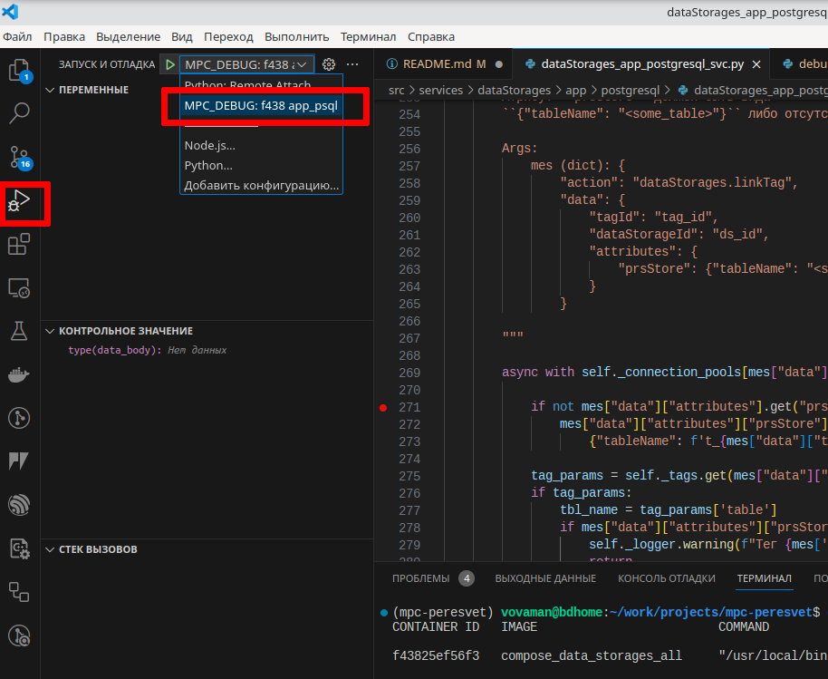

# Содержание

---

1. [`Описание`](#description)
2. [`Установка`](#installing)
3. [`Запуск и создание контейнеров`](#running)
4. [`Отладка`](#debugging)
5. [`Запуск тестов`](#tests)
6. [`Запуск нагрузочных тестов`](#load_tests)
   1. [`Тестирование платформы через прокси`](#load_tests_over_proxy)
   2. [`Тестирование платформы напрямую`](#load_tests_direct)
7. [`Генерация документации`](#make_docs)
   1. [`HTML`](#html-docs)
   2. [`PDF`](#pdf-docs)

---

**Полная текущая документация доступна по адресу https://mp-co-ru.github.io/mpc-peresvet/.**
**В настоящее время документация обновляется каждый раз,**
**когда в ветку разработки `dev` добавляется**
**новая функциональность.**

# <a name="description"></a>Описание

**МПК-Пересвет** - платформа для автоматизации технических объектов.
Главная задача - построение модели технического объекта.
Модель объекта состоит из двух частей: статическая, в виде иерархии,
и динамическая - как совокупность всех вычислительных методов, привязанных
к узлам иерархии.

Платформа может использоваться для сбора, хранения, обработки данных, а также
автоматизации процессов, протекающих в рамках технического объекта.

Отличия от баз данных реального времени (Prometheus, VictoriaMetrics и т.д.):

1. Инфраструктура. Платформа представляет собой, в первую очередь,
   инфраструктурную надстройку над базой данных реального времени,
   т.е. предлагает создание иерархии объектов, каждый из которых обладает
   набором параметров (тэгов).
2. Расчётные тэги. У объекта могут быть параметры, которые рассчитываются
   на основании других параметров.
3. Внешние расчётные методы. К событиям, происходящим в платформе
   (изменения тэгов; тревоги; расписания) могут быть привязаны как
   расчётные методы тэгов, так и просто внешние методы,
   запускающие какие-либо внешние процессы.
4. Платформа позволяет не только собирать внешние данные, но и записывать
   (через коннекторы) данные во внешние источники.
   Таким образом, на базе платформы можно строить SCADA-системы,
   системы управления умным домом и т.д.

Говоря в общем, платформа МПК-Пересвет, в отличие от большинства баз данных
реального времени, нацелена не столько на сбор метрик,
сколько на автоматизацию технических объектов.

# <a name="installing"></a> Установка

Процесс установки описан в документации:
[Установка](https://mp-co-ru.github.io/mpc-peresvet/installation.html).

# <a name="running"></a> Запуск и создание контейнеров

Docker-контейнеры - основной способ запуска сервисов платформы.
Сервисы - независимые приложения, которые общаются друг с другом
через RabbitMQ.

Возможны совершенно разные комбинации сервисов в одном контейнере.
Это открывает большие возможности по масштабированию создаваемой
информационной системы.

Релаизованные варианты запуска платформы:

## <a name="running_all_peresvet_svcs_in_one_container"></a>Все сервисы платформы в одном контейнере

```bash
$ ./run_all_svc_in_one.sh
```

## <a name="running_one_group_in_one_container"></a>Все сервисы для одной сущности в одном контейнере
Для запуска такой конфигурации достаточно запустить на исполнение скрипт:

```bash
$ ./run.sh
```

Скрипт, если необходимо, создаст контейнеры и запустит их на исполнение.
Для запуска контейнеров в фоне запускаем скрипт с ключом ``-d``:

```bash
$ ./run.sh -d
```

Для создания контейнера запускаем команду вида:

```bash
$ docker compose --env-file docker/compose/.cont_all_in_one.env -f docker/compose/docker-compose.alerts.all.yml build
```

В файле ``docker/compose/.cont_all_in_one.env`` содержатся переменные с портами
и именами хостов для следующей конфигурации:

1. Сервисы, относящиеся к одной группе, работают в одном контейнере.
2. На хостовую машину не маппируются никакие порты из контейнеров.
3. Одна точка входа в платформу - через контейнер ``nginx`` по порту 80.

## <a name="building_image_for_arm64"></a>Построение образа для архитектуры ARM64
Руководство по построению образов для разных платформ:
https://devdotnet.org/post/sborka-docker-konteinerov-dlya-arm-arhitekturi-ispolzuya-buildx/

Команда построения образа для linux/arm64
docker buildx build --platform linux/arm64 -f docker/docker-files/all/Dockerfile.all_svc.uvicorn --build-arg IMAGE_VERSION=mpc:0.4 -t mpc/peresvet_all-svc:0.4-arm64 . --load

# <a name="debugging"></a> Отладка

**Пересвет** разрабатывается с использованием VSCode, поэтому отладка описана
применительно к этому инструменту.

> Так как основной способ развёртывания платформы - в контейнерах, поэтому
> отладка сервисов производится также в контейнерах.

> Текущие версии контейнеров не экранируют исполняемый код в папку проекта,
> поэтому при изменении кода сервисов при отладке необходимо пересобирать
> контейнеры.
> Для того, чтобы при изменении кода сервиса процесс в контейнере перезапускался
> автоматически, необходимо создать новые docker-compose файлы.

> Для отладки в VSCode должен быть установлен плагин
> `ms-vscode-remote.remote-containers`.

Далее описан процесс запуска отладки.

1. Допустим, мы запустили какие-либо контейнеры с сервисами платформы.
   Если их запустить во внутреннем терминале VSCode с помощью команды

   ```bash
   $ ./run.sh -d
   ```

   , то конейнеры будут запущены в фоновом режиме и продолжать процесс можно
   будет в этом же терминале.
1. Пусть мы собираемся отлаживать сервис `app_psql`, который запущен в
   контейнере `data_storages_all`.

   Имена сервисов указаны в соответствующих файлах конфигураций для
   `nginx.unit`. К примеру:
   `mpc-peresvet/docker/docker-files/dataStorages/config_nginx.unit_dataStorages.all.json`
   в этих же файлах указывается и имя исполняемого модуля. Для нашего примера
   это `"module": "dataStorages_app_postgresql_svc"`
1. Выведем список всех работающих контейнеров, чтобы определить id нужного
   нам контейнера:

   ```bash
   $ docker ps
   CONTAINER ID   IMAGE                         COMMAND                  CREATED        STATUS       PORTS                                            NAMES
   f43825ef56f3   compose_data_storages_all     "/usr/local/bin/dock…"   8 hours ago    Up 8 hours   0.0.0.0:82->82/tcp, :::82->82/tcp                compose-data_storages_all-1
   cc6246329561   compose_alerts_all            "/usr/local/bin/dock…"   5 days ago     Up 8 hours   0.0.0.0:85-86->85-86/tcp, :::85-86->85-86/tcp    compose-alerts_all-1
   0800773b53a8   compose_methods_all           "/usr/local/bin/dock…"   5 days ago     Up 8 hours   0.0.0.0:87->87/tcp, :::87->87/tcp                compose-methods_all-1
   13ce75017a6a   compose_tags_all              "/usr/local/bin/dock…"   11 days ago    Up 8 hours   0.0.0.0:80-81->80-81/tcp, :::80-81->80-81/tcp    compose-tags_all-1
   ...
   ```

   Нужный нам контейнер - `compose-data_storages_all-1`, в качестве его id
   возьмём `f438`.
1. Находясь с корневой папке проекта, запускаем на исполнение скрипт
   `run_debug.sh`, передавая ему в качестве параметров id контейнера
   и имя сервиса для отладки:

   ```bash
   $ ./run_debug.sh f438 app_psql
   ```

   > При первом запуске отладки в контейнере будут установлены пакеты
   > `debugpy` и `uvicorn`, поэтому в связи с этим требуется соединение
   > с интернетом и первый запуск потребует несколько больше времени.

   Выполнение скрипта остановится выводом строки

   ```bash
   $ Запускаем процесс uvicorn. Для остановки процесса нажмите Ctrl+C...
   ```
1. В VSCode открываем файл запускаемого модуля. В нашем примере
   это `mpc-peresvet/src/services/dataStorages/app/postgresql/dataStorages_app_postgresql_svc.py`.
   Устанавливаем необходимые точки установки.
1. Переключаемся на панель "Запуск и отладка" и выбираем конфигурацию
   `MPC_DEBUG: f438 app_psql`:

   
1. Нажимаем `F5` или зелёную стрелку слева от имени конфигурации и входим в
   режим отладки.

Для выхода из режима отладки необходимо остановить отладку в VSCode и нажать
`Ctrl+C` в терминале, в котором был запущен скрипт `run_debug.sh`.

# <a name="tests"></a>Запуск unit-тестов

Находясь в корневой папке проекта, запускаем файл `run_tests.sh`.

Будут запущены unit-тесты, также будет показана статистика покрытия тестами исходных кодов проекта.

В модуле `ldap3` есть проблема при работе в режиме mock-сервера: объект `Connection` в режиме работы
`MOCK_SYNC` возвращает результат в другом формате, нежели при нормальной работе.

Поэтому для прогона тестов создаётся дополнительный контейнер и каждый раз при новом запуске тестов
удаляются данные, записанные во время предыдущего теста.

После прогона тестов с помощью ldap-браузера (JXplorer) можно подсоединиться
к ldap-серверу, на котором прогонялись тесты. Он доступен по порту `3890`.


> :zap:Контейнер, на котором работает тестовый ldap-сервер, называется `ldap_test`.
> Не забудьте вручную остановить контейнер `ldap_test` командой
> `$ docker stop ldap_test`

# <a name="load_tests"></a>Запуск нагрузочных тестов

В настоящем разделе содержится инструкция для разворачивания полигона для
выполнения нагрузочных тестов для команд `data/set` и `data/get`.

Предполагается, что все команды выполняются в корневой папке проекта.

## 1. ldap image

Восстанавливаем из архива образ иерархической базы с 4000 тегов, для чего
выполняем команду

```bash
$ docker load -i load_tests/images/ldap_4000_tags.tar
```

## 2. Подготовка базы данных PostgreSQL

Выполним следующее: создадим две базы данных PostgreSQL для двух разных
типов тестов, для записи и для чтения данных. Обе базы будут идентичны
по структуре таблиц, только база для тестов на чтение будет заполнена данными.

### Создание пустой базы для тестов data/set

1. Создадим каталог для базы данных PostgreSQL. Этот каталог должен быть
   вне папки проекта, так как в противном случае построение контейнеров будет
   занимать очень много времени в связи с большим размером баз.

   Допустим, каталог базы будет располагаться в корневом каталоге:

   ```bash
   $ mkdir /psql_set_data
   ```

2. Создадим пустую базу.

   Для этого откроем файл `docker-compose.postgres.set_test.yml`
   и значение параметра `volumes` приведём к следующему виду:

   ```
   - /psql_set_data:/var/lib/postgresql/data
   ```

   Сохраним файл.

   Запустим контейнер с PostgreSQL:

   ```bash
   $ docker compose -f docker-compose.postgres.set_test.yml up
   ```

   В результате в созданном нами на предыдущем шаге каталоге будет создана
   база данных `peresvet` (параметры создания базы - в файле `.env`).

3. Создадим в базе данных таблицы (их имена будут соответствовать тегам
   в восстановленной нами из архива иерархической базе):
   ```bash
   $ pipenv shell
   $ cd load_tests
   $ python create_tables.py
   ```
   Запущенный скрипт откроет файл `tags_in_postgres.json`, в котором записаны
   id всех тегов и для каждого тега создаст таблицу.

Подготовка для тестов команды `data/set` завершена.

### Создание пустой базы для тестов data/get

Теперь необходимо создать аналогичную базу и заполнить её данными.

1. Продублируем созданную базу, для чего просто скопируем каталог уже
   созданной нами базы. Выполнять команду необходимо с правами администратора.

   ```bash
   $ sudo su
   # cp -apr /psql_set_data/ /psql_get_data
   # exit
   ```

2. Откроем файл `docker-compose.postgres.get_test.yml` и исправим параметр
   `volumes`:

   ```
   - /psql_get_data:/var/lib/postgresql/data
   ```

   Сохраним файл.

3. Запустим PostgreSQL с новой базой:

   ```bash
   $ docker compose -f docker-compose.postgres.get_test.yml up
   ```

4. Заполним данными базу:
   ```bash
   $ pipenv shell
   $ cd load_tests
   $ python set_data_to_db_many.py
   ```
   > :warning: Внимание! Процесс записи данных будет долгим.

## 3. Запуск тестов data/set

Запустим все необходимые контейнеры.

```bash
$ ./run_locust_data_set_prs-psql.sh
```

В скрипте указано, что будут запущены 4 копии сервиса `peresvet`.
Это число можно изменить, исходя из правила, что количество копий сервиса
равно числу ядер процессора.

В целях ускорения работы платформы уровень логирования во всех сервисах
понижен до минимального.

При запуске платформа начинает создавать кэш для каждого тега.
Для этого требуется некоторое время, в течение которого платформа не будет
отвечать на запросы.

При отсутствии логов определить, что построение кэша закончено, можно
по активности процессов: запускаем в консоли команду `top` и наблюдаем
за активностью процессов `slapd`, `uvicorn`. Как только активность
этих процессов упадёт, значит, кэши построены.

Запускаем браузер и вводим в адресную строку: `http://localhost:8089`.


Указываем нужное количество пользователей, а также адрес - `http://nginx`.
В этом случае в тесте будут задействованы все запущенные экземпляры платформы.

Для теста одного экземпляра платформы, без nginx-прокси, в строке адреса
указываем `http://peresvet`.

После выполнения тестов можно очистить от данных базу. Для этого сначала
остановим все контейнеры, затем выполним команды:

```bash
$ docker compose -f docker-compose.postgres.set_test.yml up
$ cd load_tests
$ python delete_data.py
```

> :warning: Выполняйте скрипт удаления данных только на базе для теста
> data/set! Не путайте с data/get!

## 4. Запуск тестов data/get

Запуск тестов на получение данных аналогичен предыдущему, за исключением того,
что выполняется он скриптом

```bash
$ ./run_locust_data_get_prs-psql.sh
```

## 5. Создание новых тестов

В тестах data/set используется файл
`load_tests/src/locustfile_set_data_prs-psql.py`, а в тестах data/get -
`locustfile_get_data_prs-psql.py`.

Файлы можно расширять новыми тестами, а также создавать новые файлы.

## 6. Запуск теста реальной работы системы

Эмулируется одновременная работа 100 коннекторов, каждый из которых раз в
секунду записывает значения для 50 тегов, а также 50 экранов, каждый из
которых раз в секунду читает текущие значения для 28 тегов.

```bash
$ ./run_locust_real_job.sh
```

# <a name="make_docs"></a>Генерация документации

Документация создаётся с помощью инструмента
`"sphinx" <https://www.sphinx-doc.org/en/master/>`\_. Все необходимые пакеты
прописаны в `Pipfile` и устанавливаются автоматически при создании
окружения проекта.

## <a name="html-docs"></a> HTML

В консоли заходим в папку `docs` и выполняем команду

```bash
$ make html
```

Созданная документация будет расположена в папке `docs/build/html`.
Основной файл - `index.html`.

## <a name="pdf"></a> PDF

PDF вариант документации создаётся с помощью
`LaTeX <https://www.latex-project.org/>`\_.

Устанавливаем необходимые пакеты:

```bash
$ sudo apt-get install  texmaker gummi texlive texlive-full \
texlive-latex-recommended latexdraw intltool-debian lacheck \
lmodern luatex po-debconf tex-common texlive-binaries texlive-extra-utils \
texlive-latex-base texlive-latex-base-doc texlive-luatex texlive-xetex \
texlive-lang-cyrillic texlive-fonts-extra texlive-science \
texlive-latex-extra texlive-pstricks
```

Заходим в каталог `docs/latex` и выполняем команды:

```bash
$ pdflatex mpc_peresvet.tex
$ makeindex mpc_peresvet.idx
$ pdflatex mpc_peresvet.tex
```

В этой же папке появится сгенерированный файл документации
`mpc_peresvet.pdf`.

Для генерации исходных кодов в виде pdf-файла выполняем два раза одну и ту же
команду:

```bash
$ pdflatex sources.tex
$ pdflatex sources.tex
```
# <a name="swap_on_raspberry_pi"></a>Настройка swap-файла на Raspberry Pi

https://linuxtut.com/en/71e3874cb83ed12ec405/
