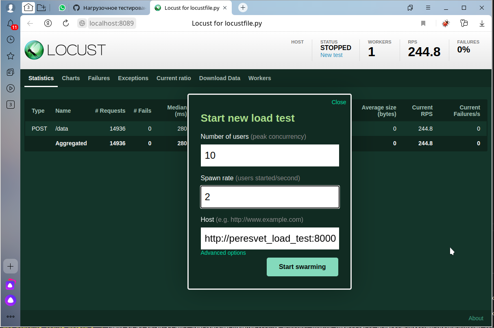

# Содержание

---

1. [`Описание`](#description)
2. [`Установка`](#installing)
3. [`Отладка`](#debugging)
4. [`Запуск тестов`](#tests)
5. [`Запуск нагрузочных тестов`](#load_tests)
   1. [`Тестирование платформы через прокси`](#load_tests_over_proxy)
   2. [`Тестирование платформы напрямую`](#load_tests_direct)
---

**Полная текущая документация доступна по адресу https://mpc-peresvet.readthedocs.io.**
**В настоящее время документация обновляется каждый раз,**
**когда в ветку разработки ``dev`` добавляется**
**новая функциональность.**


# <a name="description"></a>Описание
**МПК-Пересвет** - платформа для автоматизации технических объектов.
Главная задача - построение модели технического объекта.
Модель объекта состоит из двух частей: статическая, в виде иерархии,
и динамическая - как совокупность всех вычислительных методов, привязанных
к узлам иерархии.

Платформа может использоваться для сбора, хранения, обработки данных, а также
автоматизации процессов, протекающих в рамках технического объекта.

Отличия от баз данных реального времени (Prometheus, VictoriaMetrics и т.д.):
1. Инфраструктура. Платформа представляет собой, в первую очередь,
   инфраструктурную надстройку над базой данных реального времени,
   т.е. предлагает создание иерархии объектов, каждый из которых обладает
   набором параметров (тэгов).
2. Расчётные тэги. У объекта могут быть параметры, которые рассчитываются
   на основании других параметров.
3. Внешние расчётные методы. К событиям, происходящим в платформе
   (изменения тэгов; тревоги; расписания) могут быть привязаны как
   расчётные методы тэгов, так и просто внешние методы,
   запускающие какие-либо внешние процессы.
4. Платформа позволяет не только собирать внешние данные, но и записывать
   (через коннекторы) данные во внешние источники.
   Таким образом, на базе платформы можно строить SCADA-системы,
   системы управления умным домом и т.д.

Говоря в общем, платформа МПК-Пересвет, в отличие от большинства баз данных
реального времени, нацелена не столько на сбор метрик,
сколько на автоматизацию технических объектов.

# <a name="installing"></a> Установка

> :zap: Здесь описывается процесс установки платформы на одном компьютере.
> В первую очередь, для целей разработки.
> Для более полной информации по возможным вариантам установки
> см. документацию по продукту, раздел "Установка".

> :zap: Платформа тестировалась на Ubuntu 22.04.

1. Установите [Docker](https://docs.docker.com/get-docker/).
2. Скопируйте или склонируйте на свой компьютер этот проект.
   [Ссылка](https://github.com/mp-co-ru/mpc-peresvet).
3. Зайдите в корневую папку проекта и запустите на исполнение файл ``run.sh``.
   В результате запустятся основные контейнеры:
   1. Платформа (peresvet);
   2. Иерархическая база (ldap);
   3. База данных реального времени (victoriametrics);
   4. Прокси-сервер Nginx (nginx);
   5. Grafana (grafana).


# <a name="debugging"></a> Отладка
**Пересвет** разрабатывается с использованием VSCode, поэтому отладка описана применительно к этому инструменту.

Для отладки в VSCode должен быть установлен плагин `ms-vscode-remote.remote-containers`.

Отладка настроена по рецепту, предложенному https://github.com/Kludex/fastapi-docker-debug.

Запуск отладки:
1. Создаем в VSCode новый терминал: `Terminal -> New terminal` (`Терминал -> Создать терминал`).
2. В терминале выполняем команду: ```$ docker-compose -f docker-compose.peresvet.yml -f docker-compose.debug.yml up```
3. Нажимаем `F5`...
4. Мы вошли в режим отладки приложения.

# <a name="tests"></a>Запуск тестов
Находясь в корневой папке проекта, запускаем файл `run_tests.sh`.

Будут запущены функциональные тесты, также будет показана статистика покрытия тестами исходных кодов проекта.

В модуле `ldap3` есть проблема при работе в режиме mock-сервера: объект `Connection` в режиме работы
`MOCK_SYNC` возвращает результат в другом формате, нежели при нормальной работе.

Поэтому для прогона тестов создаётся дополнительный контейнер и каждый раз при новом запуске тестов
удаляются данные, записанные во время предыдущего теста.

После прогона тестов можно подсоединиться к ldap-серверу, на котором прогонялись тесты. Он доступен по порту `3890`.
Сервис, на котором работает тестовый ldap-сервер, называется `ldap_test`.

# <a name="load_tests"></a>Запуск нагрузочных тестов
Нагрузочный тест: в иерархии описаны порядка 540 тэгов. Список идентификаторов
этих тэгов и их типы - в файле ``load_tests/ids.json``.

Из списка тэгов случайным образом выбирается один и для него генерируется
случайное значение. Это значение затем передаётся в платформу.

Перед запуском нагрузочного тестирования загрузите образ с исходными данными
для иерархической базы данных. Находясь в корневой папке проекта, выполните
команду:
```bash
$ docker load < Docker/images/ldap_for_load_test.tar.gz
```
В списке образов должен появиться новый образ с именем ``mpc/ws_ldap_for_load_test:0.2``.

Для запуска нагрузочного тестирования в корневой папке проекта выполните команды:
```bash
$ docker compose -f docker-compose.loadtest.locust.yml build
$ docker compose -f docker-compose.loadtest.locust.yml up
```

Затем откройте браузер и в строке адреса введите ``http://localhost:8089``.

## <a name="load_tests_over_proxy">Тестирование платформы через прокси
В окне выбора параметров теста в качестве адреса сервера введите
``http://nginx``:



В этом случае тестовые запросы будут идти через прокси-сервер Nginx.
При этом можно запустить несколько экземпляров платформы, чтобы
проверить влияние на скорость работы.

Для изменения количества экземпляров платформы выполните команду:
```bash
$ docker compose -f docker-compose.loadtest.locust.yml up --scale peresvet=<количество экземпляров>
```
В команде подставьте нужное количество экземпляров.

## <a name="load_tests_direct">Тестирование платформы напрямую
В этом случае в окне выбора параметров теста в качестве адреса сервера введите
``http://peresvet``.

Запросы от Locust пойдут напрямую к платформе, минуя прокси-сервер.

# Приблизительный план разработки
## Первый этап
1. В качестве базы данных реального времени используем [Victoriametrics](https://victoriametrics.com/).
2. Web-клиент для просмотра данных - [Grafana](https://grafana.com/).
3. Grafana забирает данные непосредственно из VictoriaMetrics, минуя **Пересвет**.
4. Параметры (тэги) хранятся линейным списком, иерархия объектов не поддерживается.
## Второй этап
1. Создание типового коннектора как поставщика данных.
2. Создание на базе типового - коннектора для контроллера ESP32.
3. Реальный рабочий пример - отдельный проект для мониторинга и управления насосной станцией.
## Третий этап
Дальнейшее развитие функциональности:
1. Иерархия объектов.
2. Расчётные тэги.
3. Использование других TSDB.
4. Одновременное использование нескольких хранилищ.
5. Работа с камерами.
6. И т.д.
