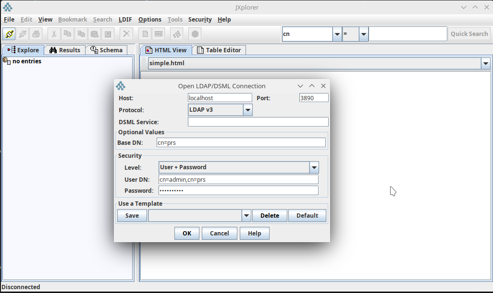

# Содержание

---

1. [`Описание`](#description)
2. [`Установка`](#installing)
3. [`Отладка`](#debugging)
4. [`Запуск тестов`](#tests)
5. [`Запуск нагрузочных тестов`](#load_tests)
   1. [`Тестирование платформы через прокси`](#load_tests_over_proxy)
   2. [`Тестирование платформы напрямую`](#load_tests_direct)
---

**Полная текущая документация доступна по адресу https://mpc-peresvet.readthedocs.io.**
**В настоящее время документация обновляется каждый раз,**
**когда в ветку разработки ``dev`` добавляется**
**новая функциональность.**


# <a name="description"></a>Описание
**МПК-Пересвет** - платформа для автоматизации технических объектов.
Главная задача - построение модели технического объекта.
Модель объекта состоит из двух частей: статическая, в виде иерархии,
и динамическая - как совокупность всех вычислительных методов, привязанных
к узлам иерархии.

Платформа может использоваться для сбора, хранения, обработки данных, а также
автоматизации процессов, протекающих в рамках технического объекта.

Отличия от баз данных реального времени (Prometheus, VictoriaMetrics и т.д.):
1. Инфраструктура. Платформа представляет собой, в первую очередь,
   инфраструктурную надстройку над базой данных реального времени,
   т.е. предлагает создание иерархии объектов, каждый из которых обладает
   набором параметров (тэгов).
2. Расчётные тэги. У объекта могут быть параметры, которые рассчитываются
   на основании других параметров.
3. Внешние расчётные методы. К событиям, происходящим в платформе
   (изменения тэгов; тревоги; расписания) могут быть привязаны как
   расчётные методы тэгов, так и просто внешние методы,
   запускающие какие-либо внешние процессы.
4. Платформа позволяет не только собирать внешние данные, но и записывать
   (через коннекторы) данные во внешние источники.
   Таким образом, на базе платформы можно строить SCADA-системы,
   системы управления умным домом и т.д.

Говоря в общем, платформа МПК-Пересвет, в отличие от большинства баз данных
реального времени, нацелена не столько на сбор метрик,
сколько на автоматизацию технических объектов.

# <a name="installing"></a> Установка

## Установка для запуска
> :zap: Здесь описывается процесс установки платформы на одном компьютере.
> В первую очередь, для целей разработки.
> Для более полной информации по возможным вариантам установки
> см. документацию по продукту, раздел "Установка".

> :zap: Платформа тестировалась на Ubuntu 22.04.

1. Установите [Docker](https://docs.docker.com/get-docker/).
2. Скопируйте или склонируйте на свой компьютер этот проект.
   [Ссылка](https://github.com/mp-co-ru/mpc-peresvet).
3. Зайдите в корневую папку проекта и запустите на исполнение файл ``run.sh``.
   В результате запустятся основные контейнеры:
   1. Платформа (peresvet);
   2. Иерархическая база (ldap);
   3. База данных реального времени (victoriametrics);
   4. Прокси-сервер Nginx (nginx);
   5. Grafana (grafana).

## Установка для разработки
В проекте используется модуль ``python-ldap``, поэтому перед установкой
окружения проекта выполните команду:
```bash
$ sudo apt-get install build-essential python3-dev \
libldap2-dev libsasl2-dev slapd ldap-utils tox lcov valgrind
```
После этого зайдите в корневую папку проекта и выполните:
```bash
$ pipenv shell
```

# <a name="debugging"></a> Отладка
**Пересвет** разрабатывается с использованием VSCode, поэтому отладка описана применительно к этому инструменту.

Для отладки в VSCode должен быть установлен плагин `ms-vscode-remote.remote-containers`.

Отладка настроена по рецепту, предложенному https://github.com/Kludex/fastapi-docker-debug.

Запуск отладки:
1. Создаем в VSCode новый терминал: `Terminal -> New terminal` (`Терминал -> Создать терминал`).
2. В терминале выполняем команду: ```$ docker compose -f docker-compose.peresvet.yml -f docker-compose.debug.yml up```
3. Нажимаем `F5`...
4. Мы вошли в режим отладки приложения.

# <a name="tests"></a>Запуск unit-тестов
Находясь в корневой папке проекта, запускаем файл `run_tests.sh`.

Будут запущены unit-тесты, также будет показана статистика покрытия тестами исходных кодов проекта.

В модуле `ldap3` есть проблема при работе в режиме mock-сервера: объект `Connection` в режиме работы
`MOCK_SYNC` возвращает результат в другом формате, нежели при нормальной работе.

Поэтому для прогона тестов создаётся дополнительный контейнер и каждый раз при новом запуске тестов
удаляются данные, записанные во время предыдущего теста.

После прогона тестов с помощью ldap-браузера (JXplorer) можно подсоединиться
к ldap-серверу, на котором прогонялись тесты. Он доступен по порту `3890`.



> :zap:Контейнер, на котором работает тестовый ldap-сервер, называется `ldap_test`.
> Не забудьте вручную остановить контейнер `ldap_test` командой
> `$ docker stop ldap_test`

# <a name="load_tests"></a>Запуск нагрузочных тестов
В настоящем разделе содержится инструкция для разворачивания полигона для
выполнения нагрузочных тестов для команд `data/set` и `data/get`.

Предполагается, что все команды выполняются в корневой папке проекта.

## 1. ldap image
Восстанавливаем из архива образ иерархической базы с 4000 тегов, для чего
выполняем команду

```bash
$ docker load -i load_tests/images/ldap_4000_tags.tar
```

## 2. Подготовка базы данных PostgreSQL
Выполним следующее: создадим две базы данных PostgreSQL для двух разных
типов тестов, для записи и для чтения данных. Обе базы будут идентичны
по структуре таблиц, только база для тестов на чтение будет заполнена данными.

### Создание пустой базы для тестов data/set

1. Создадим каталог для базы данных PostgreSQL. Этот каталог должен быть
   вне папки проекта, так как в противном случае построение контейнеров будет
   занимать очень много времени в связи с большим размером баз.

   Допустим, каталог базы будет располагаться в корневом каталоге:

   ```bash
   $ mkdir /psql_set_data
   ```

2. Создадим пустую базу.

   Для этого откроем файл `docker-compose.postgres.set_test.yml`
   и значение параметра `volumes` приведём к следующему виду:
   ```
   - /psql_set_data:/var/lib/postgresql/data
   ```
   Сохраним файл.

   Запустим контейнер с PostgreSQL:
   ```bash
   $ docker compose -f docker-compose.postgres.set_test.yml up
   ```
   В результате в созданном нами на предыдущем шаге каталоге будет создана
   база данных `peresvet` (параметры создания базы - в файле `.env`).

3. Создадим в базе данных таблицы (их имена будут соответствовать тегам
   в восстановленной нами из архива иерархической базе):
   ```bash
   $ pipenv shell
   $ cd load_tests
   $ python create_tables.py
   ```
   Запущенный скрипт откроет файл `tags_in_postgres.json`, в котором записаны
   id всех тегов и для каждого тега создаст таблицу.

Подготовка для тестов команды `data/set` завершена.

### Создание пустой базы для тестов data/get
Теперь необходимо создать аналогичную базу и заполнить её данными.

1. Продублируем созданную базу, для чего просто скопируем каталог уже
   созданной нами базы. Выполнять команду необходимо с правами администратора.
   ```bash
   $ sudo su
   # cp -apr /psql_set_data/ /psql_get_data
   # exit
   ```

2. Откроем файл `docker-compose.postgres.get_test.yml` и исправим параметр
   `volumes`:
   ```
   - /psql_get_data:/var/lib/postgresql/data
   ```
   Сохраним файл.

3. Запустим PostgreSQL с новой базой:
   ```bash
   $ docker compose -f docker-compose.postgres.get_test.yml up
   ```

4. Заполним данными базу:
   ```bash
   $ pipenv shell
   $ cd load_tests
   $ python set_data_to_db_many.py
   ```
   > :warning: Внимание! Процесс записи данных будет долгим.

## 3. Запуск тестов data/set
Запустим все необходимые контейнеры.
```bash
$ ./run_locust_data_set_prs-psql.sh
```
В скрипте указано, что будут запущены 4 копии сервиса `peresvet`.
Это число можно изменить, исходя из правила, что количество копий сервиса
равно числу ядер процессора.

В целях ускорения работы платформы уровень логирования во всех сервисах
понижен до минимального.

При запуске платформа начинает создавать кэш для каждого тега.
Для этого требуется некоторое время, в течение которого платформа не будет
отвечать на запросы.

При отсутствии логов определить, что построение кэша закончено, можно
по активности процессов: запускаем в консоли команду `top` и наблюдаем
за активностью процессов `slapd`, `uvicorn`. Как только активность
этих процессов упадёт, значит, кэши построены.

Запускаем браузер и вводим в адресную строку: `http://localhost:8089`.


Указываем нужное количество пользователей, а также адрес - `http://nginx`.
В этом случае в тесте будут задействованы все запущенные экземпляры платформы.

Для теста одного экземпляра платформы, без nginx-прокси, в строке адреса
указываем `http://peresvet`.

После выполнения тестов можно очистить от данных базу. Для этого сначала
остановим все контейнеры, затем выполним команды:
```bash
$ docker compose -f docker-compose.postgres.set_test.yml up
$ cd load_tests
$ python delete_data.py
```

> :warning: Выполняйте скрипт удаления данных только на базе для теста
> data/set! Не путайте с data/get!


## 4. Запуск тестов data/get
Запуск тестов на получение данных аналогичен предыдущему, за исключением того,
что выполняется он скриптом
```bash
$ ./run_locust_data_get_prs-psql.sh
```

## 5. Создание новых тестов
В тестах data/set используется файл
`load_tests/src/locustfile_set_data_prs-psql.py`, а в тестах data/get -
`locustfile_get_data_prs-psql.py`.

Файлы можно расширять новыми тестами, а также создавать новые файлы.

## 6. Запуск теста реальной работы системы
Эмулируется одновременная работа 100 коннекторов, каждый из которых раз в
секунду записывает значения для 50 тегов, а также 50 экранов, каждый из
которых раз в секунду читает текущие значения для 28 тегов.
```bash
$ ./run_locust_real_job.sh
```
