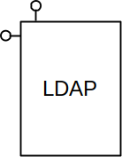
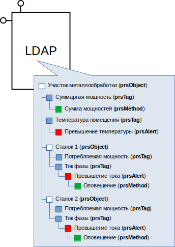
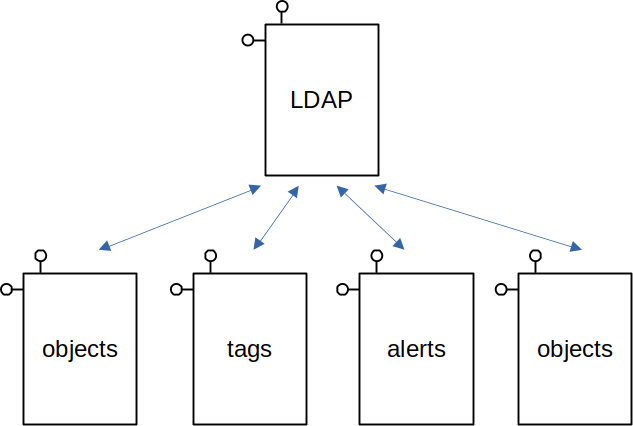
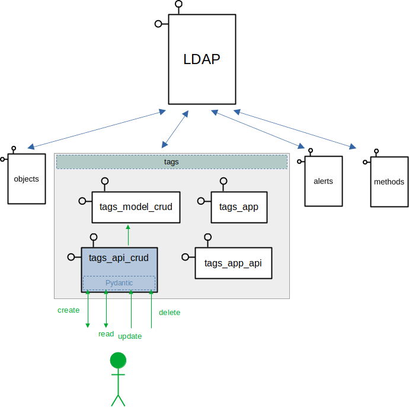
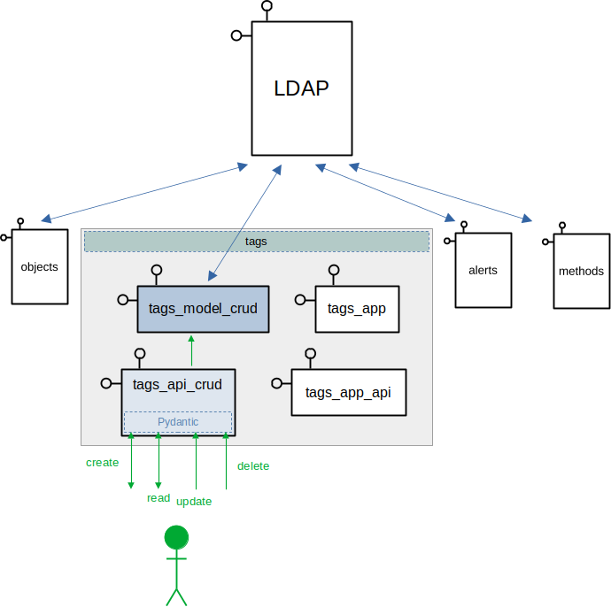
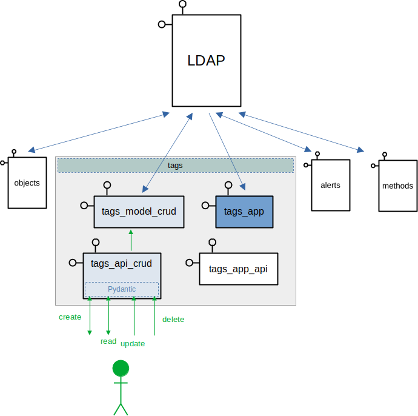
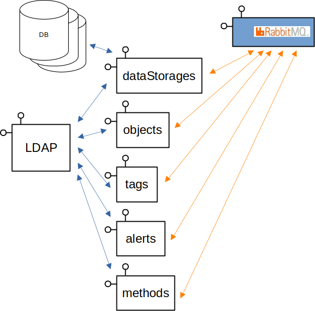
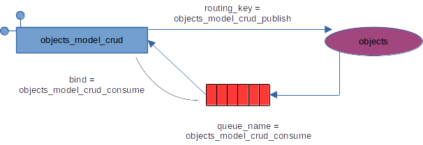
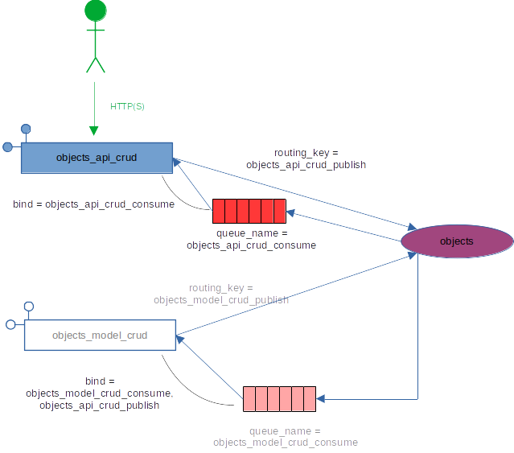

.. include:: <isonum.txt>

.. |br| raw:: html

    

Архитектура платформы
=====================
Общее описание
--------------
Архитектура платформы обуславливается, в значительной степени, создаваемой
ей моделью технического объекта.

Модель технического объекта состоит из двух частей: статической и динамической.
Статическая модель описывает сущности и экземпляры этих сущностей,
а динамическая - процессы, протекающие между экземплярами сущностей.

Статическая модель
------------------
Статическая модель технических объектов, особенно в промышленности, хорошо
описывается иерархической структурой. К примеру:

``Предприятие`` |rarr| ``Цех`` |rarr| ``Участок`` |rarr|
``Технологическая линия`` |rarr| ``Агрегат``.

Поэтому в архитектуре появляется LDAP-сервер, с помощью которого
строится иерархия.

    LDAP-сервер

Каждый узел в иерархии LDAP-сервера имеет свой определённый класс.
На рисунке ниже представлена иерархия узлов.

В скобках указан класс узла.

    Иерархия

На рисунке выше показан пример иерархии. Белыми квадратами показаны экземпляры
сущности ``object`` (класс в иерархии - ``prsObject``), голубыми - теги,
красными - тревоги (alerts), зелёными - методы.

.. note::
   Имена всех классов в иерархии строятся по принципу: ``prs<Имя сущности>``.
   Префикс ``prs`` облегчает фильтрацию классов, добавленных в схему сервера
   платформой.
   Имена атрибутов также имеют префикс ``prs``.

1. Главный узел - ``Участок металлообработки``. Класс - ``prsObject``.
2. ``Участок`` содержит два тега:

   * ``Суммарная мощность`` (всех станков на участке);
   * ``Температура помещения``.
3. Тег ``Участок металлообработки.Суммарная мощность`` имеет метод для
   вычисления суммы мощностей всех станков на участке.
4. Тег ``Участок металлообработки.Температура помещения`` имеет тревогу
   ``Превышение температуры``, которая срабатывает при превышении некоторого
   установленного значения.
5. У объекта ``Участок`` - два дочерних объекта: ``Станок 1`` и ``Станок 2``.
6. Каждый станок имеет два тега:

   * ``Потребляемая мощность``;
   * ``Ток фазы``.
7. Tег ``Ток фазы`` имеет тревогу ``Превышение тока``, которая, в свою очередь,
   имеет метод ``Оповещение``.

Таким образом, в примере иерархии содержатся экземпляры четырёх сущностей:
``objects``, ``tags``, ``alerts``, ``methods``.

.. note::
   В иерархии LDAP-сервера содержатся сущности, относящиеся не столько к модели
   самого технического объекта, сколько к модели информационной системы. Это
   такие сущности, как: хранилища данных (dataStorages), коннекторы (connectors),
   расписания (schedules).

Сервисы
-------
Каждая сущность, присутствующая в иерархии, управляется своим сервисом.

    Сервисы

В действительности, каждый сервис - это, в общем случае, набор из четырёх
независимых микросервисов:

.. figure:: pics/architecture_04.png
    :align: center

    Микросервисы

<сущность>_api_crud
~~~~~~~~~~~~~~~~~~~
Микросервис, принимающий от пользователя или, в общем, от любых внешних
клиентов, запросы на создание, чтение, обновление, удаление экземпляров
сущности (команды CRUD).

Главная задача этого микросервиса - принять запрос от клиента и проверить
корректность параметров запроса (в случае, если миросервис реализован
на языке Python, то удобно для этих целей пользоваться модулем ``pydantic``).

Вторая задача - отправить соответствующий запрос микросервису
``<сущность>_model_crud``:

    <сущность>_api_crud

Выделение описанной функциональности в отдельный микросервис облегчает
управление версиями API, позволяя, в том числе, работать одновременно
нескольким версиям. Вопрос только в запуске/остановке соответствующего
микросервиса.

<сущность>_model_crud
~~~~~~~~~~~~~~~~~~~~~
Микросервис, работающий с узлами сущности в иерархии. Именно этот сервис
реализует непосредственную работу с иерархической моделью, взаимодействуя
с LDAP-сервером.

    <сущность>_model_crud

<сущность>_app
~~~~~~~~~~~~~~
Иерархическая модель - не вещь в себе. Узлы в ней определяют, как функционирует
модель технического объекта.
То есть микросервис ``<сущность>_app`` определяет ту функциональность, ради
которой экземпляры сущности и создаются.
Например, для тегов это, в первую очередь, функции записи/чтения данных.
Для тревог - функциональность по инициации/квитированию/прападанию тревог.

Таким образом, сервис ``<сущность>_app`` читает из иерархии описания
узлов соответствующего типа и работает согласно этим описаниям.
Например, к тегу ``Температура помещения`` привязана тревога
``Превышение температуры``. Так вот именно сервис ``alerts_app`` будет
отслеживать значение температуры и генерировать, при необходимости, тревогу.

    <сущность>_app

<сущность>_app_api
~~~~~~~~~~~~~~~~~~
Микросервис предоставляет клиентам доступ к функциональности сервиса
``<сущность>_app``. В случае тегов - это команды ``data/set``, ``data/get``.

В случае тревог - команды квитирования, получения списка активных тревог и
т.д.

.. figure:: pics/architecture_08.png
    :align: center

    <сущность>_app_api

Базовые сущности, входящие в ядро МПК Пересвет
~~~~~~~~~~~~~~~~~~~~~~~~~~~~~~~~~~~~~~~~~~~~~~
Объекты
"""""""
.. note::
   Сущность ``objects``, класс в иерархии ``prsObject``.

Базовый узел в иерархии. Каждый узел сущности ``objects`` может иметь
любое количество дочерних узлов этой же сущности. Таким образом обеспечивается
возможность создания иерархии объектов любой сложности.

Теги
""""
.. note::
   Сущность ``tags``, класс в иерархии ``prsTag``

Тег - это параметр объекта. Например: температура, давление, расход, и т.д.

Теги бывают обычные, в которые данные поступают из внешних источников
(датчики, SCADA, ручной ввод и т.д.), а также рассчитываемые.

.. raw:: html

   <embed>
      

   </embed>

**Например:**

* тег ``Потребляемая мощность`` у объекта ``Котёл`` в системе "умного дома" -
  обычный тег, данные в который поступают от "умной" розетки по протоколу
  "ZigBee";
* тег ``Общий расход газа на собственные нужды`` объекта ``Промысел`` -
  вычисляемый и является суммой затрат газа на котельные промысла,
  а также потерь на факел;

Но ничто не мешает тегу быть одновременно и обычным, и рассчитываемым. То есть
данные в тег могут поступать из внешнего источника, редактироваться
пользователем, а также, в определённых случаях, рассчитываться.

.. raw:: html

   <embed>
      

   </embed>

Новое значение тега может инициировать расчёт значений других тегов. В таком
случае в иерархии указывается, расчёт каких тегов инициируется изменением
значения данного тега.

Тревоги
"""""""
.. note::
   Сущность ``alerts``, класс в иерархии ``prsAlert``

Тревога - событие, возникающее при определённых условиях. Тревоги применяются,
в основном, для сигнализации о каких-то событиях (не обязательно критичных и
плохих, как может показаться из названия сущности, просто так сложилось
в АСУТП).

События возникновения тревог, также как и события изменения тегов и
события расписаний, могут запускать выполнение определённых процессов.

Экземпляр сущности ``alerts`` обязательно привязан к какому-либо тегу.
Каждое изменение значения тега, к которому привязаны тревоги, будет приводить к
пересчету условий возникновения тревог. Если условие выполняется, то произойдёт
событие возникновения тревоги.

.. raw:: html

   <embed>
      

   </embed>

**Например:**

Объект "Паропровод". У него есть тег - "Температура пара". К тегу привязана
тревога "Превышение температуры". В условиях тревоги указано, что она должна
возникать при превышении значения температуры в 120 |deg| C.

Таким образом, каждое изменение тега будет приводить к проверке условия, что
новое значение тега превышает значение в 120 |deg| C. Если условие выполняется,
то произойдёт событие возникновения тревоги.

.. raw:: html

   <embed>
      

   </embed>

Обычно в АСУТП тревоги бывают четырёх типов: LOLO-LO-HI-HIHI.

То есть:

* ``LOLO`` - нижний критичный уровень;
* ``LO`` - нижний предупредительный уровень;
* ``HI`` - верхний предупредительный уровень;
* ``HIHI`` - верхний критичный уровень.

В отличие от принятой практики, МПК Пересвет допускает создание любого
количества тревог, привязанных к тегу.

Кроме того, существуют дополнительные возможности при создании тревог:

* отложенные тревога;
  тревога, которая возникает спустя некоторое время после изменения значения
  тега на критичное

.. raw:: html

   <embed>
      

   </embed>

**Например:**
Тревога должна возникать, если температура пара в паропроводе превышает
120 |deg| C на протяжении не менее двух минут. Иначе ситуация считается
нормальной.

.. raw:: html

   <embed>
      

   </embed>

* сложные тревоги;
  это такие тревоги, которые имеют сложные условия возникновения; к таким
  тревогам привязывается вычислительный метод, который определяет, должна ли
  возникать тревога; такие тревоги позволяют учитывать значения нескольких
  тегов, а также вообще любые дополнительные условия.

Тревоги могут быть квитируемые и не квитируемые.

Квитируемые тревоги - это такие тревоги, которые не исчезают до тех пор, пока
пользователь не отметит, что он их заметил (квитировал)

.. raw:: html

   <embed>
      

   </embed>

**Например:**
Тревога "Превышение температуры" у паропровода должна быть обязательно замечена
оператором, потому как возникновение такой тревоги влечёт за собой
необходимость проведения определённых работ по обслуживанию паропровода.

Поэтому даже после снижения температуры ниже 120 |deg| C тревога не пропадёт,
пока оператор не отметит, что заметил эту тревогу.

.. raw:: html

   <embed>
      

   </embed>

Методы
""""""
.. note::
   Сущность ``methods``, класс в иерархии ``prsMethod``

Методы применяются:

* для вычисления значений тегов;
* для вычисления условий возникновения аварий;
* привязываются к событиям расписания, инициируя, таким образом, выполнение
  определённых вычислений/действий по расписанию;
* для запуска каких-либо процессов (рассылка почты, диспетчерские процессы
  при возникновении определённых событий и т.д.)

Хранилища данных
""""""""""""""""
.. note::
   Сущность ``dataStorages``, класс в иерархии ``prsDataStorage``

Сущность относится не к модели технического объекта, а к модели информационной
системы.

Хранилище данных - это база данных, в которой хранятся исторические значения
тегов и тревог.

В настоящий момент поддерживаются `PostgreSQL <https://www.postgresql.org/>`_
и `Victoriametrics <https://victoriametrics.com/>`_.

При написании соответствующего драйвера могут поддерживаться любые виды
хранилищ.

Платформа поддерживает возможность одновременной работы нескольких хранилищ,
причём разных типов.

Коннекторы
""""""""""
.. note::
   Сущность ``connectors``, класс в иерархии ``prsConnector``

Коннектор - специальная программа, являющаяся поставщиком данных от какого-либо
источника.

Обычно реализует собой возможность чтения данных по какому-либо протоколу
(modbus, OPC и т.д.).

Коннектор устанавливается как можно ближе к источнику данных,
инициирует связь с платформой по протоколу Websocket и передаёт в платформу
счианные из источника данных значения.

В свою очередь, принимает от платформы по этому же каналу сообщения об
измнениях параметров тегов и т.д.

Константы
"""""""""
.. note::
   Сущность ``constants``, класс в иерархии ``prsConstant``

Константы - определённые значения, используемые в рамках всей системы.
Передаются в вычислительные методы.

.. raw:: html

   <embed>
      

   </embed>

**Например:** константа ``pieColors``: словарь, в котором указывается набор
цветов для отображения "пирогов" в отчётах.

.. raw:: html

   <embed>
      

   </embed>

Расписания
""""""""""
.. note::
   Сущность ``schedules``, класс в иерархии ``prsSchedule``

Расписание определяет моменты возникновения событий, привязанных ко времени.
Эти события могут вызывать выполнение определённых методов:

* расчёт вычисляемых тегов;
* запуск выполнения внешних методов.

"Комплекты" сервисов
~~~~~~~~~~~~~~~~~~~~
Необязательно для каждой сущности должен существовать комплект из четырёх
микросервисов.

.. raw:: html

   <embed>
      

   </embed>

**Например:**

Константы - это сущность ``constants``. Имеет только два сервиса:
``constants_api_crud`` - API для создания-чтения-обновления-удаления констант и
``constants_model_crud`` - собственно, сам функционал для работы с иерархией.
Никакой собственной функциональности у констант нет. Они существуют только для
того, чтобы передаваться в методы. То есть, используются при работе сущности
``methods``.

Другой пример - сущность ``connectors``, коннекторы. Имеет три микросервиса:
``connectors_api_crud``, ``connectors_model_crud``, ``connectors_app``.
Микросервиса ``connectors_app_api`` нет, так как ``connectors_app``
не предоставляет никакой функциональности внешним клиентам. Задача
``connectors_app`` - поддержание связи по веб-сокету с коннекторами и приём
от них данных с дальнейшей отсылкой в платформу.

Ещё один пример - хранилища данных, сущность ``dataStorages``. Также не имеет
сервиса ``datastorages_app_api``, но имеет много разных сервисов
``datastorages_app``, каждый из которых реализует свой тип базы данных.

.. raw:: html

   <embed>
      

   </embed>

Другие сервисы
~~~~~~~~~~~~~~
Платформа спроектирована таким образом, что допускает расширение списка
сущностей, которые могут присутствовать в статической модели и, соответственно,
внутри иерархии.

Для каждой новой сущности необходимо необходимо создать свой класс в схеме
LDAP-сервера и разработать комплект микросервисов, взяв за основу базовые
классы.

Экземпляры сущности в иерархии могут создаваться:

1. Внутри своего базового узла. Например:

   * основная иерархия - модель технического объекта, строится внутри
     узла ``objects``;
   * список хранилищ данных - внутри узла ``dataStorages``.

2. Внутри базовой иерархии - модели технического объекта. Например:

   * тревоги: тревоги могут создаваться только внутри узлов класса ``prsTag``,
     так как тревоги существуют только в привязке к тегам;
   * методы: могут быть привязаны к тегам или тревогам.

3. Внутри своего базового узла или внутри базовой иерархии. Примером здесь
   могут служить теги. Теги, чаще всего, создаются внутри основной иерархии,
   в качестве дочерних узлов для узлов класса ``prsObjects``.

   Но также возможны простые случаи применения платформы, для автоматизации
   совсем небольших объектов, где нет необходимости создавать иерархию
   объектов, то есть для автоматизации достаточно создать несколько тегов.

   В этом случае теги могут быть созданы линейным списком внутри узла ``tags``.

Хранилища данных
----------------
Значения тегов и тревог записываются в хранилища данных. В настоящий момент
поддерживаются два типа хранилищ: PostgreSQL и Victoriametrics.
Для поддержки нового типа хранилища необходимо написать соответствующий
микросервис.

.. figure:: pics/architecture_09.png
    :align: center

    Хранилища данных

Допускается одновременная работа нескольких хранилищ данных, как одного типа,
так и разных. Таким образом, можно хранить историю значений тегов и тревог
в разных хранилищах.

Брокер очередей сообщений
-------------------------
Таким образом, платформа представляет собой большое количество микросервисов.

Более того, одновременно может быть запущено несколько экземпляров каждого
микросервиса, причем на разных серверах. Этим реализуется масштабируемость
и высокая доступность (high availability) платформы.

Микросервисы работают не сами по себе, они взаимодействуют. Реализовывать
внутри каждого микросервиса связь со всеми необходимыми ему микросервисами -
непродуктивно.

Для реализации общения между микросервисами в архитектуру платформы добавлен
брокер очередей сообщений - `RabbitMQ <www.rabbitmq.com>`_.

    Брокер сообщений

.. attention::
   Для понимания системы общения внутри платформы необходимо прочитать
   (не обязательно полное) руководство на RabbitMQ, с тем, чтобы хорошо
   разбираться в терминах:

   * обменник (exchange), а также в их типах (FANOUT, DIRECT, TOPIC);
   * очередь (queue);
   * привязка и ключ маршрутизации (binding, routing key).

Обменники сервисов
~~~~~~~~~~~~~~~~~~
Как упоминалось выше в разделе `Сервисы`_, для каждой сущности создаётся,
в общем случае, группа из четырёх микросервисов.

.. note:: Рекомендуемый подход:
   каждая группа сервисов для сущности имеет свой отдельный обменник.

Каждый микросервис, стартуя, создаёт в этом обменнике очередь, в которой будет
ожидать управляющие команды. Также через этот обменник сервис публикует
свои сообщения, указывая в качестве ключа маршрутизации указанную
в конфигурации строку.

Конфигурирование
""""""""""""""""
Далее на рисунках показан рекомендуемый подход к конфигурированию системы
сообщений.

Начнём с группы сервисов ``objects``.

    Сервис ``objects_model_crud``.

На рисунке видим, что сервис ``objects_model_crud``:

1. Публикует в обменник
   ``objects`` свои сообщения с
   ``routing_key = objects_model_crud_publish``.
2. Создаёт очередь ``objects_model_crud_consume`` и делает ей привязку
   с таким же именем. В этой очереди сервис ожидает сообщения.

Таким образом, получаем следующую конфигурацию обменников для сервиса
``objects_model_crud``:

.. code:: python

   {
      # блок "публикаций"
      "publish": {
         # главный обменник;
         # в следующих реализациях, возможно, потребуются дополнительные
         # обменники, они будут описаны в своих ключах
         "main": {
            # имя обменника
            "name": "objects",
            # тип всех обменников - direct, но возможно, в классах-наследниках
            # потребуются другие типы, поэтому тип указываем явно
            "type": "direct",
            # ключ маршрутизации по умолчанию, но, для большей гибкости,
            # также задаём его имя
            "routing_key": ["objects_model_crud_publish"]
         }
      },
      # блок "потребления"
      "consume": {
         "main": {
            "name": "objects",
            "type": "direct",
            "queue_name": "objects_model_crud_consume",
            "routing_key": ["objects_model_crud_consume"]
         }
      }
   }

Добавляем в группу сервис ``objects_api_crud``:

    Сервис ``objects_api_crud``.

Логика та же, что и у предыдущего сервиса.

.. warning:: На рисунке видно, что ``objects_api_crud`` может принимать
   сообщения по протоколу HTTP(S) и из очереди.
   В текущей реализации команды CRUD принимаются только по протоколу HTTP(S).

Конфигурация сервиса аналогична предыдущей, за исключением имён очередей
и ключей маршрутизации:

.. code:: python

   {
      "publish": {
         "main": {
            "name": "objects",
            "type": "direct",
            "routing_key": ["objects_api_crud_publish"]
         }
      },
      "consume": {
         "main": {
            "name": "objects",
            "type": "direct",
            "queue_name": "objects_api_crud_consume",
            "routing_key": ["objects_api_crud_consume"]
         }
      }
   }

Обратите внимание, что, так как сервис ``objects_model_crud`` ожидает сообщения
от сервиса ``objects_api_crud``, то к его consume-очереди
мы добавляем дополнительный ключ маршрутизации: ``objects_api_crud_publish``.

Таким образом, конфигурация сервиса ``objects_model_crud`` становится такой:

.. code:: python

   {
      "publish": {
         "main": {
            "name": "objects",
            "type": "direct",
            "routing_key": ["objects_model_crud_publish"]
         }
      },
      "consume": {
         "main": {
            "name": "objects",
            "type": "direct",
            "queue_name": "objects_model_crud_consume",
            "routing_key": [
               "objects_model_crud_consume",
               "objects_api_crud_publish"
            ]
         }
      }
   }

Логика сообщений при создании, обновлении и удалении узлов
~~~~~~~~~~~~~~~~~~~~~~~~~~~~~~~~~~~~~~~~~~~~~~~~~~~~~~~~~~
Рассмотрим следующую ситуацию.

Допустим, у нас есть иерархия и в этой иерархии - узел класса
``prsСущность_1``. Через некоторое время была создана группа сервисов
для работы с новой сущностью ``Сущность_2``, причём узлы-экземпляры этой
сущности являются дочерними по отношению к узлам сущности ``Сущность_1``.

Таким образом, ``Сущность_2`` разработана позже и ``Сущность_1`` ничего
не "знает" о наличии ``Сущность_2``.

.. code::

   Узел_1 (prsСущность_1)
    ├ Узел_2 (prsСущность_2)
    └ Узел_3 (prsСущность_2)

Далее допустим, что в сервис ``Сущность_1_api_crud`` приходит команда на
удаление узла ``Узел_1``. Команда затем поступает в сервис
``Сущность_1_model_crud``, который и выполняет удаление узла.

При этом удаляется полностью вся иерархия под узлом ``Узел_1``.

Соответственно, сервисы группы ``Сущность_2`` остаются в полном неведении
о том, что "их" узлы тоже удалены.

Не смотря на то, что сервис ``Сущность_1_model_crud`` посылает после удаления
узла сообщение c ``"action": "deleted"``, на которое подписан сервис
``Сущность_2_app``, ``Сущность_2`` не может корректно обработать удаление
"своих" узлов, так как они уже удалены из иерархии и информация о них
потеряна.

Для избежания этой коллизии процесс удаления узла сущности реализован
следующим образом.

1. При старте сервис ``сущность_2_model_crud`` уведомляет
   сервис ``сущность_1_model_crud`` о том,
   что перед удалением или изменением узлов ``Сущность_1`` его, то есть
   сервис ``сущность_2_model_crud``, необходимо уведомить.
2. Сервис ``сущность_1_model_crud`` хранит список заинтересованных сервисов.
3. Перед изменением или удалением "своего" узла сервис
   ``сущность_1_model_crud`` посылает запросы типа RPC всем подписавшимся
   сервисам (ниже - пример последовательности запросов при удалении узла,
   при этом в теле запроса указывается id удаляемого узла):

   * ``may_delete``: Можно ли удалять узел? В ответе от каждого
     заинтересованного сервиса должен прийти ответ: да или нет.
     Если хотя бы один сервис пришлёт ответ "нет", то узел не будет удалён;
   * ``deleting``: в случае, если на предыдущее сообщение все заинтересованные
     сервисы ответили "да", то посылается это сообщение, уведомляя все
     заинтересованные сервисы о удалении узла ``Узел_1``; в процессе обработки
     этого сообщения все заинтересованные сервисы (``сущность_2_model_crud``)
     корректно удаляют "свои" узлы из иерархии и отсылают ответ сервису
     ``сущность_1_model_crud`` о завершении работы по удалению своих узлов.

4. После выполнения запроса ``deleting``, дождавшись ответа от всех
   заинтересованных подписчиков, сервис ``сущность_1_model_crud`` удаляет
   узел ``Узел_1`` и рассылает через свой обменник
   ``сущность_1_model_crud_pub`` сообщение об удалении узла ``Узел_1``.

.. warning::
   Остаётся проблема: если между запросами ``may_delete`` и ``deleting``
   произошло что-то, что накладывает дополнительные ограничения на удаление
   узла. Например, произошла подписка нового сервиса.

   Решение проблемы откладываем на будущие версии.

Рассмотрим сказанное выше на примере сервисов
``tags_model_crud`` и ``objects_model_crud``:

1. Сервис ``tags_model_crud`` получает сообщение о создании нового тега:

   .. image:: pics/subscribers_01.png

2. В процессе обработки сообщения ``tags_model_crud`` создаёт в иерархии новые
   узлы:

   .. image:: pics/subscribers_02.png

3. ...и посылает в обменник ``objects`` сообщение о подписке:

   .. image:: pics/subscribers_03.png

4. Сервис ``objects_model_crud``, получив это сообщение, добавляет в узел
   ``subscribers`` узел ``tags_model_crud_consume``:

   .. image:: pics/subscribers_04.png

5. Теперь при изменении/удалении объекта "123" сервис ``objects_model_crud``
   посылает всем подписавшимся RPC-сообщения:

   a. ``may_delete``. В теле сообщения указывается id объекта для удаления.
      В поле ``reply_to`` ``objects_model_crud`` указывает ``routing_key``
      для очереди, в которой будет ожидать ответ.

      Получив сообщение ``may_delete``, ``tags_model_crud`` ищет теги,
      привязанные к удаляемому объекту и определяет, можно ли их удалить. Для
      этого он сам посылает сообщение
      ``may_delete`` уже своим подписчикам, указывая удаляемые теги.

      Если хотя бы от одного подписчика придёт ответ ``no``, что означает,
      что объект удалять нельзя, то процедура прервётся.
   b. Если все подписчики прислали ответ ``ok``, то ``objects_model_crud``
      рассылает всем новое сообщение - ``deleting``. Получив это сообщение,
      ``tags_model_crud`` должен выполнить работу по удалению всех тегов
      удаляемого объекта (при этом сам должен разослать сообщение
      ``deleting`` всем своим подписчикам).
   c. После того, как в ответ на ``deleting`` вернулись ответы ``ok`` от всех
      подписчиков, ``objects_model_crud`` удаляет объет.
   d. ``objects_model_crud`` посылает сообщение ``deleted``.

Таким образом, сервис ``<сущность>_model_crud`` имеет следующую базовую
конфигурацию обменников:

.. code:: python

   {
      "publish": {
         # основной обменник, в который сервис шлёт свои сообщения
         "main": {
            # как правило - один обменник на всю группу сервисов
            # для одной сущности
            "name": "<сущность>",
            "type": "direct",
            "routing_key": "<сущность>_model_crud_publish"
         }
      },
      "consume": {
         # главный обменник, от которого сервис ждёт управляющие команды
         "main": {
            "name": "<сущность>",
            "type": "direct",
            "queue": "<сущность>_model_crud_consume",
            "routing_key": "<сущность>_model_crud_consume"
         }
      },
      # блок описания обменников тех сущностей, на которые должен
      # подписаться сервис
      "subscribe": {
         # сущность, уведомления об изменение/удаление узлов которой
         # требуются сервису
         "<сущность_2>": {
            # в этот обменник сервис будет посылать сообщение "subscribe"
            "publish": {
               "name": "<сущность_2>",
               "type": "direct",
               "routing_key": "<сущность_2>_model_crud_consume"
            },
            # обменник, из которого сервис будет получать уведомления об
            # изменениях узлов
            # (к этому обменнику, с указанным routing_key будет привязана
            # главная очередь сервиса с управляющими командами)
            "consume": {
               "name": "<сущность_2>",
               "type": "direct",
               "routing_key": "<сущность_2>_model_crud_publish"
            }
         }
      }
   }

Типовые сообщения сервисов
~~~~~~~~~~~~~~~~~~~~~~~~~~
.. note:: В таблицах сообщений предполагаем следующее:

   1. Обменник, в который публикует сообщения сервис, имеет имя ``<сущность>``.
   2. Если в колонке ``RPC`` стоит плюс, значит, посылающий сообщение сервис
      ожидает ответ. В этом случае у сообщения выставлены параметры
      ``reply_to`` и ``correlation_id``,
      поэтому их не указываем в таблицах.
   3. Формат тела сообщений (за исключением ответов при RPC):

      .. code:: python

         {
            "action": "<some_action>",
            "data": {
            }
         }

      где

      * ``action`` - тип команды,
      * ``data`` - параметры команды

<сущность>_model_crud
"""""""""""""""""""""
**Publish**

.. table:: Сообщения, генерируемые сервисом ``<сущность>_model_crud``

   +-----------+----------------------------------+-----+---------------------------------+
   |  action   |        routing_key               | RPC | Какому сервису предназначено    |
   +===========+==================================+=====+=================================+
   | created   | <сущность>_model_crud_publish    | `-` | Всем подписанным сервисам       |
   +-----------+----------------------------------+-----+---------------------------------+
   |                                                                                      |
   |  .. raw:: html                                                                       |
   |                                                                                      |
   |     
                                                                        |
   |     
<a>Описание</a>
                                               |
   |                                                                                      |
   |     Сообщение посылается сервисом после создания нового узла в иерархии.         |
   |     В теле сообщения указывается ``id`` нового узла.                                 |
   |                                                                                      |
   |     
                                                                       |
   |                                                                                  |
   |     
                                                                        |
   |     
<a>Тело сообщения</a>
                                         |
   |                                                                                      |
   |  .. code-block:: python                                                              |
   |                                                                                      |
   |     {                                                                                |
   |        "action": "created",                                                          |
   |        "data": {                                                                     |
   |           "id": "<new_node_id>"                                                      |
   |        }                                                                             |
   |     }                                                                                |
   |                                                                                      |
   |  .. raw:: html                                                                       |
   |                                                                                      |
   |     
                                                                       |
   +-----------+----------------------------------+-----+---------------------------------+
   | may_update | Список ключей маршрутизации |br| | `+` | Все сервисы, подписавшиеся |br| |
   |           | указан в иерархии, |br|          |     | на получение уведомлений |br|   |
   |           | в дочернем узле |br|             |     | изменения/удаления узлов |br|   |
   |           | ``cn=subscribers,cn=system``     |     |                                 |
   +-----------+----------------------------------+-----+---------------------------------+
   |                                                                                      |
   |  .. raw:: html                                                                       |
   |                                                                                      |
   |     
                                                                        |
   |     
<a>Описание</a>
                                               |
   |                                                                                      |
   |     Первая команда-уведомление о том, что узел готовится к обновлению.           |
   |     Все подписавшиеся на уведомления сервисы должны ответить ``ok``              |
   |     или ``no``.                                                                      |
   |     
                                                                       |
   |                                                                                  |
   |     
                                                                        |
   |     
<a>Тело сообщения</a>
                                         |
   |                                                                                      |
   |  .. code:: python                                                                    |
   |                                                                                      |
   |     {                                                                                |
   |        "action": "may_update",                                                        |
   |        "data": {                                                                     |
   |              # узел, который предполагается изменить                                 |
   |              "id": "<node_id>",                                                      |
   |              # id нового родительского узла, в случае, если узел                     |
   |              # предполагается переместить                                            |
   |              "parentId": "<new_parent_id>",                                          |
   |              # новые значения атрибутов                                              |
   |              "attributes": {                                                         |
   |              }                                                                       |
   |        }                                                                             |
   |     }                                                                                |
   |                                                                                      |
   |  .. raw:: html                                                                       |
   |                                                                                      |
   |     
                                                                       |
   |                                                                                  |
   |     
                                                                        |
   |     
<a>Тело ответа</a>
                                            |
   |                                                                                      |
   |  .. code:: python                                                                    |
   |                                                                                      |
   |     {                                                                                |
   |           "response": "ok",                                                          |
   |           "message": "некоторое сообщение, если ответ `no`"                          |
   |     }                                                                                |
   |                                                                                      |
   |  .. raw:: html                                                                       |
   |                                                                                      |
   |     
                                                                       |
   +-----------+----------------------------------+-----+---------------------------------+
   | updating  | Список ключей маршрутизации |br| | `+` | Все сервисы, подписавшиеся |br| |
   |           | указан в иерархии, |br|          |     | на получение уведомлений |br|   |
   |           | в дочернем узле |br|             |     | изменения/удаления узлов |br|   |
   |           | ``cn=subscribers,cn=system``     |     |                                 |
   +-----------+----------------------------------+-----+---------------------------------+
   |                                                                                      |
   |  .. raw:: html                                                                       |
   |                                                                                      |
   |     
                                                                        |
   |     
<a>Описание</a>
                                               |
   |                                                                                      |
   |     Вторая команда-уведомление. Её рассылка говорит о том, что все               |
   |     подписавшиеся сервисы согласились с обновлением узла, и теперь должны        |
   |     провести работу, связанную с обновлением родительского узла.                     |
   |     
                                                                       |
   |                                                                                  |
   |     
                                                                        |
   |     
<a>Тело сообщения</a>
                                         |
   |                                                                                      |
   |  .. code:: python                                                                    |
   |                                                                                      |
   |     {                                                                                |
   |        "action": "updating",                                                         |
   |        "data": {                                                                     |
   |              # узел, который предполагается изменить                                 |
   |              "id": "<node_id>",                                                      |
   |              # id нового родительского узла, в случае, если узел                     |
   |              # предполагается переместить                                            |
   |              "parentId": "<new_parent_id>",                                          |
   |              # новые значения атрибутов                                              |
   |              "attributes": {                                                         |
   |              }                                                                       |
   |        }                                                                             |
   |     }                                                                                |
   |                                                                                      |
   |  .. raw:: html                                                                       |
   |                                                                                      |
   |     
                                                                       |
   |                                                                                  |
   |     
                                                                        |
   |     
<a>Тело ответа</a>
                                            |
   |                                                                                      |
   |  .. code:: python                                                                    |
   |                                                                                      |
   |     {                                                                                |
   |           "response": "ok"                                                           |
   |     }                                                                                |
   |                                                                                      |
   |  .. raw:: html                                                                       |
   |                                                                                      |
   |     
                                                                       |
   +-----------+----------------------------------+-----+---------------------------------+
   | updated   | <сущность>_model_crud_publish    | `-` | Всем подписанным сервисам       |
   +-----------+----------------------------------+-----+---------------------------------+
   |                                                                                      |
   |  .. raw:: html                                                                       |
   |                                                                                      |
   |     
                                                                        |
   |     
<a>Описание</a>
                                               |
   |                                                                                      |
   |     Сообщение о том, что узел был изменён.                                           |
   |     
                                                                       |
   |                                                                                  |
   |     
                                                                        |
   |     
<a>Тело сообщения</a>
                                         |
   |                                                                                      |
   |  .. code:: python                                                                    |
   |                                                                                      |
   |     {                                                                                |
   |        "action": "updated",                                                          |
   |        "data": {                                                                     |
   |              "id": "<node_id>"                                                       |
   |        }                                                                             |
   |     }                                                                                |
   |                                                                                      |
   |  .. raw:: html                                                                       |
   |                                                                                      |
   |     
                                                                       |
   |                                                                                  |
   +-----------+----------------------------------+-----+---------------------------------+
   | may_delete | Список ключей маршрутизации |br| | `+` | Все сервисы, подписавшиеся |br| |
   |           | указан в иерархии, |br|          |     | на получение уведомлений |br|   |
   |           | в дочернем узле |br|             |     | изменения/удаления узлов |br|   |
   |           | ``cn=subscribers,cn=system``     |     |                                 |
   +-----------+----------------------------------+-----+---------------------------------+
   |                                                                                      |
   |  .. raw:: html                                                                       |
   |                                                                                      |
   |     
                                                                        |
   |     
<a>Описание</a>
                                               |
   |                                                                                      |
   |     Первая команда-уведомление о том, что узел готовится к удалению.             |
   |     Все подписавшиеся на уведомления сервисы должны ответить ``ok``              |
   |     или ``no``.                                                                      |
   |     
                                                                       |
   |                                                                                  |
   |     
                                                                        |
   |     
<a>Тело сообщения</a>
                                         |
   |                                                                                      |
   |  .. code:: python                                                                    |
   |                                                                                      |
   |     {                                                                                |
   |        "action": "may_delete",                                                        |
   |        "data": {                                                                     |
   |              # узел, который предполагается удалить                                  |
   |              "id": "<node_id>"                                                       |
   |        }                                                                             |
   |     }                                                                                |
   |                                                                                      |
   |  .. raw:: html                                                                       |
   |                                                                                      |
   |     
                                                                       |
   |                                                                                  |
   |     
                                                                        |
   |     
<a>Тело ответа</a>
                                            |
   |                                                                                      |
   |  .. code:: python                                                                    |
   |                                                                                      |
   |     {                                                                                |
   |           "response": "ok"                                                           |
   |     }                                                                                |
   |                                                                                      |
   |  .. raw:: html                                                                       |
   |                                                                                      |
   |     
                                                                       |
   +-----------+----------------------------------+-----+---------------------------------+
   | deleting  | Список ключей маршрутизации |br| | `+` | Все сервисы, подписавшиеся |br| |
   |           | указан в иерархии, |br|          |     | на получение уведомлений |br|   |
   |           | в дочернем узле |br|             |     | изменения/удаления узлов |br|   |
   |           | ``cn=subscribers,cn=system``     |     |                                 |
   +-----------+----------------------------------+-----+---------------------------------+
   |                                                                                      |
   |  .. raw:: html                                                                       |
   |                                                                                      |
   |     
                                                                        |
   |     
<a>Описание</a>
                                               |
   |                                                                                      |
   |     Вторая команда-уведомление. Её рассылка говорит о том, что все               |
   |     подписавшиеся сервисы согласились с удалением узла, и теперь должны          |
   |     провести работу, связанную с удалением родительского узла.                       |
   |     
                                                                       |
   |                                                                                  |
   |     
                                                                        |
   |     
<a>Тело сообщения</a>
                                         |
   |                                                                                      |
   |  .. code:: python                                                                    |
   |                                                                                      |
   |     {                                                                                |
   |        "action": "deleting",                                                         |
   |        "data": {                                                                     |
   |              # узел, который предполагается удалить                                  |
   |              "id": "<node_id>"                                                       |
   |        }                                                                             |
   |     }                                                                                |
   |                                                                                      |
   |  .. raw:: html                                                                       |
   |                                                                                      |
   |     
                                                                       |
   |                                                                                  |
   |     
                                                                        |
   |     
<a>Тело ответа</a>
                                            |
   |                                                                                      |
   |  .. code:: python                                                                    |
   |                                                                                      |
   |     {                                                                                |
   |           "response": "ok"                                                           |
   |     }                                                                                |
   |                                                                                      |
   |  .. raw:: html                                                                       |
   |                                                                                      |
   |     
                                                                       |
   +-----------+----------------------------------+-----+---------------------------------+
   | deleted   | <сущность>_model_crud_publish    | `-` | Всем подписанным сервисам       |
   +-----------+----------------------------------+-----+---------------------------------+
   |                                                                                      |
   |  .. raw:: html                                                                       |
   |                                                                                      |
   |     
                                                                        |
   |     
<a>Описание</a>
                                               |
   |                                                                                      |
   |     Сообщение о том, что узел был удалён.                                            |
   |     
                                                                       |
   |                                                                                  |
   |     
                                                                        |
   |     
<a>Тело сообщения</a>
                                         |
   |                                                                                      |
   |  .. code:: python                                                                    |
   |                                                                                      |
   |     {                                                                                |
   |        "action": "deleted",                                                          |
   |        "data": {                                                                     |
   |              "id": "<node_id>"                                                       |
   |        }                                                                             |
   |     }                                                                                |
   |                                                                                      |
   |  .. raw:: html                                                                       |
   |                                                                                      |
   |     
                                                                       |
   |                                                                                  |
   +-----------+----------------------------------+-----+---------------------------------+

**Consume**

Все сообщения для сервиса приходят в очередь ``<сущность>_model_crud_consume``,
``routing_key = <сущность>_model_crud_consume``.

.. table:: Сообщения, обрабатываемые сервисом ``<сущность>_model_crud``

   +-------------+-----+--------------------------------------------------------------------+
   |  action     | RPC | Описание                                                           |
   +=============+=====+====================================================================+
   | subscribe   | `-` | Сообщение приходит от другого сервиса, который заинтересован |br|  |
   |             |     | в получении уведомлений о изменении/удалении определённых узлов    |
   +-------------+-----+--------------------------------------------------------------------+
   |  .. raw:: html                                                                         |
   |                                                                                        |
   |     
                                                                          |
   |     
<a>Тело сообщения</a>
                                           |
   |                                                                                        |
   |  .. code:: python                                                                      |
   |                                                                                        |
   |     {                                                                                  |
   |        "action": "subscribe",                                                          |
   |        "data": {                                                                       |
   |              "routing_key": "<some_routing_key>"                                       |
   |              "id": ["<id_1>", "id_2"]                                                  |
   |        }                                                                               |
   |     }                                                                                  |
   |                                                                                        |
   |  .. raw:: html                                                                         |
   |                                                                                        |
   |     
                                                                         |
   |                                                                                    |
   +-------------+-----+--------------------------------------------------------------------+
   | unsubscribe | `-` | Сообщение приходит от другого сервиса, который сообщает |br|       |
   |             |     | об отказе в получении уведомлений о изменении/удалении узлов       |
   +-------------+-----+--------------------------------------------------------------------+
   |  .. raw:: html                                                                         |
   |                                                                                        |
   |     
                                                                          |
   |     
<a>Тело сообщения</a>
                                           |
   |                                                                                        |
   |  .. code:: python                                                                      |
   |                                                                                        |
   |     {                                                                                  |
   |        "action": "unsubscribe",                                                        |
   |        "data": {                                                                       |
   |              "routing_key": "<some_routing_key>"                                       |
   |              "id": ["<id_1>", "id_2"]                                                  |
   |        }                                                                               |
   |     }                                                                                  |
   |                                                                                        |
   |  .. raw:: html                                                                         |
   |                                                                                        |
   |     
                                                                         |
   |                                                                                    |
   +-------------+-----+--------------------------------------------------------------------+
