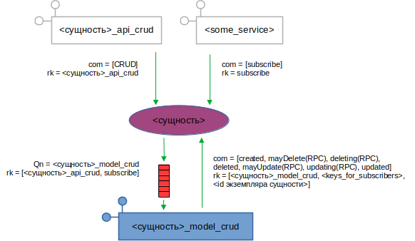

Общие классы
~~~~~~~~~~~~
В этом разделе описаны общие классы, от которых наследуются все сервисы,
а также классы, используемые всеми сервисами.

Модуль ``hierarchy``
""""""""""""""""""""
.. automodule:: src.common.hierarchy
   :members:
   :private-members:
   :show-inheritance:
   :noindex:

Модуль ``logger``
"""""""""""""""""
.. automodule:: src.common.logger
   :members:
   :private-members:
   :exclude-members: InterceptHandler
   :show-inheritance:
   :noindex:

Модуль ``base_svc``
"""""""""""""""""""
.. automodule:: src.common.base_svc
    :members:
    :private-members:
    :show-inheritance:
    :noindex:

Модуль ``base_svc_settings``
"""""""""""""""""""""""""""""
.. automodule:: src.common.base_svc_settings
    :members:
    :show-inheritance:
    :noindex:

Модуль ``svc``
""""""""""""""
.. automodule:: src.common.svc
    :members:
    :private-members:
    :show-inheritance:
    :noindex:

Модуль ``svc_settings``
"""""""""""""""""""""""
.. automodule:: src.common.svc_settings
    :members:
    :show-inheritance:
    :noindex:

Модуль ``api_crud_svc``
"""""""""""""""""""""""
.. automodule:: src.common.api_crud_svc
    :members:
    :show-inheritance:
    :noindex:

Модуль ``model_crud_svc``
"""""""""""""""""""""""""
Модуль содержит базовый класс сервиса, реализующего функциональность работы с
иерархией для какой-либо сущности (создание, обновление, поиск, удаление
узлов).
Сообщения сервиса:

**Обновление и удаление узлов-экземпляров сущности**

Внутри иерархии узла-экземпляра сущности могут быть узлы-экземпляры других,
заранее неизвестных сущностей.

Удаление узла-экземпляра сущности приводит к удалению всей принадлежащей ему
иерархии. Соответственно, сервисы, управляющие другими сущностями, возможно,
входящими в иерархию узла-родителя, будут поставлены перед фактом удаления
"своих" узлов.

Это неприемлемо, так как в процессе удаления узла в иерархии должна быть
проделана определённая работа. К примеру, при удалении тега - удаление
истории его значений. Более того, возможно, что определённые дочерние сущности
могут запретить удаление родительского узла. Например, удаление константы не
может быть произведено, если она используется в каком-либо методе.

Для решения этой проблемы используется следующий алгоритм (рассмотрим
на примере сервисов ``tags_model_crud`` и ``objects_model_crud``):

1. Сервис ``tags_model_crud`` получает сообщение о создании нового тега:

   .. image:: pics/subscribers_01.png

2. В процессе обработки сообщения ``tags_model_crud`` создаёт в иерархии новые
   узлы:

   .. image:: pics/subscribers_02.png

3. ...и посылает в обменник ``objects`` сообщение о подписке:

   .. image:: pics/subscribers_03.png

4. Сервис ``objects_model_crud``, получив это сообщение, добавляет в узел
   ``subscribers`` узел ``tags_model_crud``:

   .. image:: pics/subscribers_04.png

5. Теперь при изменении/удалении объекта "123" сервис ``objects_model_crud``
   посылает всем подписавшимся RPC-сообщения:

   a. ``mayDelete``. В теле сообщения указывается id объекта для удаления.
      В поле ``reply_to`` ``objects_model_crud`` указывает ``routing_key``
      для очереди, в которой будет ожидать ответ.

      Получив сообщение ``mayDelete``, ``tags_model_crud`` ищет теги,
      привязанные к удаляемому объекту и определяет, можно ли их удалить. Для
      этого он сам посылает сообщение
      ``mayDelete`` уже своим подписчикам, указывая удаляемые теги.

      Если хотя бы от одного подписчика придёт ответ ``no``, что означает,
      что объект удалять нельзя, то процедура прервётся.
   b. Если все подписчики прислали ответ ``ok``, то ``objects_model_crud``
      рассылает всем новое сообщение - ``deleting``. Получив это сообщение,
      ``tags_model_crud`` должен выполнить работу по удалению всех тегов
      удаляемого объекта (при этом сам должен разослать сообщение
      ``deleting`` всем своим подписчикам).
   c. После того, как в ответ на ``deleting`` вернулись ответы ``ok`` от всех
      подписчиков, ``objects_model_crud`` удаляет объет.
   d. ``objects_model_crud`` посылает сообщение ``deleted``.

Таким образом, сервис ``<сущность>_model_crud`` имеет следующую базовую
конфигурацию обменников:

.. code:: python

   config = {
      "publish": {
         # основной обменник, в который сервис шлёт свои сообщения
         "main": {
            # как правило - один обменник на всю группу сервисов
            # для одной сущности
            "name": "<сущность>",
            "type": "direct",
            "routing_key": "<сущность>_model_crud_publish"
         }
      },
      "consume": {
         # главный обменник, от которого сервис ждёт управляющие команды
         "main": {
            "name": "<сущность>",
            "type": "direct",
            "queue": "<сущность>_model_crud_consume",
            "routing_key": "<сущность>_model_crud_consume"
         }
      },
      # блок описания обменников тех сущностей, на которые должен
      # подписаться сервис
      "subscribe": {
         # сущность, уведомления об изменение/удаление узлов которой
         # требуются сервису
         "<сущность_2>": {
            # в этот обменник сервис будет посылать сообщение "subscribe"
            "publish": {
               "name": "<сущность_2>",
               "type": "direct",
               "routing_key": "<сущность_2>_model_crud_consume"
            },
            # обменник, из которого сервис будет получать уведомления об
            # изменениях узлов
            # (к этому обменнику, с указанным routing_key будет привязана
            # главная очередь сервиса с управляющими командами)
            "consume": {
               "name": "<сущность_2>",
               "type": "direct",
               "routing_key": "<сущность_2>_model_crud_publish"
            }
         }
      }
   }

.. automodule:: src.common.model_crud_svc
   :members:
   :private-members:
   :show-inheritance:
   :noindex:

Модуль ``model_crud_settings``
""""""""""""""""""""""""""""""
.. automodule:: src.common.model_crud_settings
   :members:
   :private-members:
   :show-inheritance:
   :noindex:
