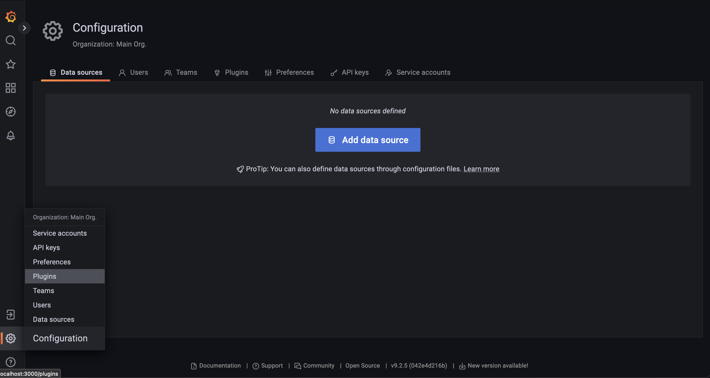
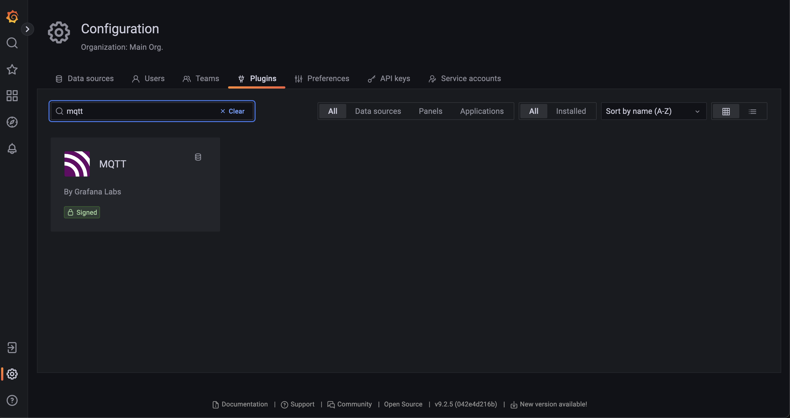
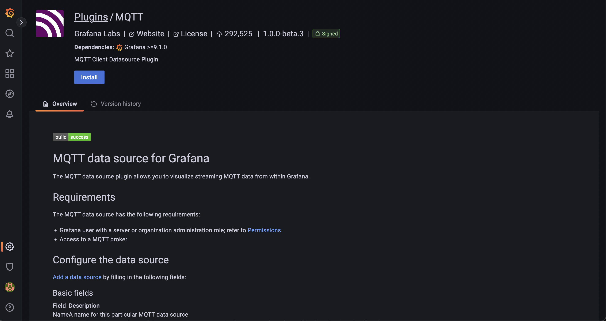
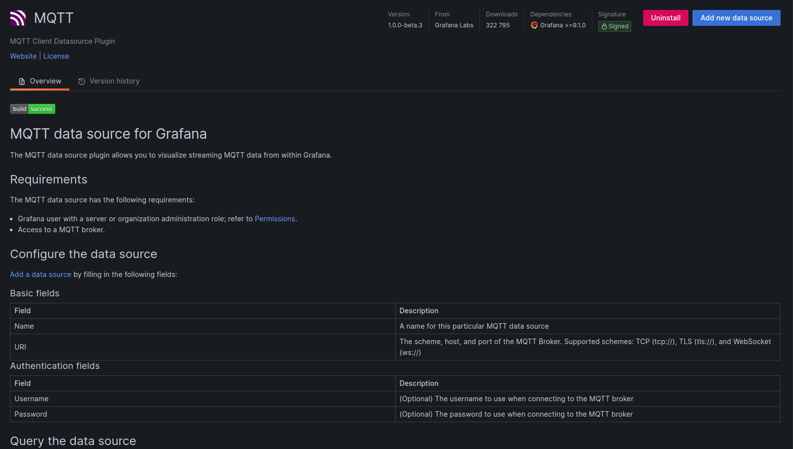
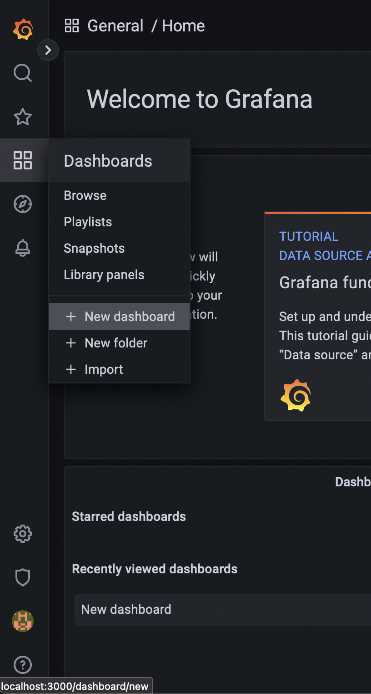
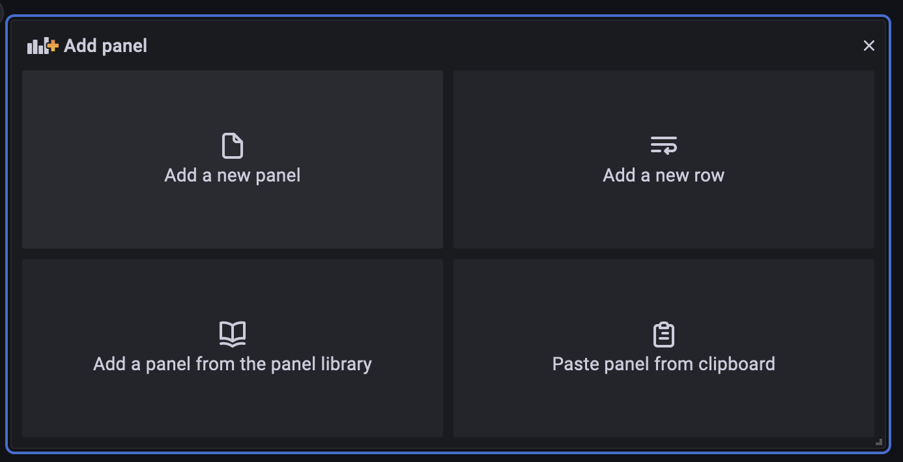
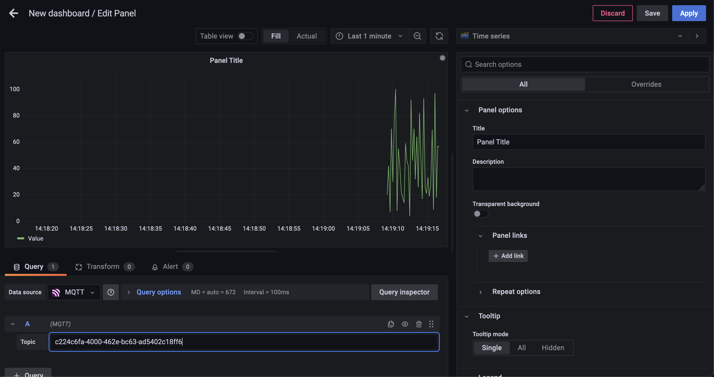

Интеграция с Grafana
====================
Установим платформу и Grafana: :ref:`installation`.

#. Перейдите в браузер и откройте https://localhost:<порт grafana (по умолчанию 3000)>/login
#. В форме авторизации введите `admin` в качестве пользователя и `admin` в качестве пароля.

Подключение к платформе по протоколу MQTT
-----------------------------------------
В состав платформы входит брокер сообщений `RabbitMQ <https://www.rabbitmq.com/>`_.
Для связи с Grafana в RabbitMQ установлен плагин MQTT, также плагин MQTT необходимо
установить и в Grafana.

Настройка источника данных в Grafana
~~~~~~~~~~~~~~~~~~~~~~~~~~~~~~~~~~~~
* Для установки плагина MQTT нужно перейти в раздел `Connections` и ввести в поиске mqtt.

    Меню плагинов

    Поиск MQTT плагина

* Выбираем появившийся плагин и нажимаем Install.

    Установка плагина

* После установки нажимаем кнопку ``Add new data source``.

    Создание нового источника данных

* Для настройки нового источника данных нужно указать

   .. figure:: ../pics/grafana_setup_conf_datasource.png
      :align: center

      Настройка источника данных

   * Название источника данных
   * URL адрес для подключения: ``tcp://rabbitmq:1883``
   * Имя пользователя и пароль для авторизации в брокере

Отображение данных из платформы
~~~~~~~~~~~~~~~~~~~~~~~~~~~~~~~
Для отображения данных из платформы необходимо:

#. Cоздать новый dashboard и панель.

    Создание нового дэшборда

    Создание новой панели

#. Настроить источник данных в панели, а именно:
   #. Указать в качестве источника MQTT
   #. Прописать id тега, который необходимо отобразить. По нему данные из платформы через брокер сообщений будут поступать в панель.

      .. note:: В брокере сообщений RabbitMQ, в качестве обменника для получения данных, Grafana MQTT плагин использует `amq.topic`.

    Настройка источника данных в панели

После этого данные появятся и будут отображаться в панели.

.. warning:: ВАЖНО! Необходимо отключить автообновление дэшборда, если хотя бы одна панель использует MQTT плагин
   Автообновление нарушает ее работу и сбрасывает все данные, которые она получила до обновления.

   .. figure:: ../pics/grafana_setup_turn_off_refresh.png
       :align: center

Отправка данных из Grafana в платформу
--------------------------------------

Для отправки данных из Grafana необходимо установить плагин формы ручного ввода.

Установка плагина
~~~~~~~~~~~~~~~~~

Linux/MacOS
"""""""""""

.. code-block:: sh

   wget "https://github.com/mp-co-ru/grafana-ui-plugin/mp-co-peresvet-app-1-0-0.zip" -O <директория для плагинов в Grafana>/mp-co-peresvet-app-1-0-0.zip
   unzip <директория для плагинов в Grafana>/mp-co-peresvet-app-1-0-0.zip -d <директория для плагинов в Grafana>/mp-co-peresvet-app-1-0-0
   rm <директория для плагинов в Grafana>/mp-co-peresvet-app-1-0-0.zip

.. note::
   Директория для плагинов в Grafana по умолчанию находится по пути `/usr/local/var/lib/grafana/plugins`.

Docker
""""""

.. code-block:: sh

   docker run -d -p 3000:3000 --name=grafana \
   -e "GF_INSTALL_PLUGINS=https://github.com/mp-co-ru/grafana-ui-plugin/mp-co-peresvet-app-1-0-0.zip;mp-co-peresvet-app" \
   grafana/grafana-enterprise

Для его работы дополнительная настройка Grafana не требуется
Подробнее про запуск, конфигурацию и работу плагина

`Плагин для формы ручного ввода в Grafana <./grafana_plugin.rst>`
