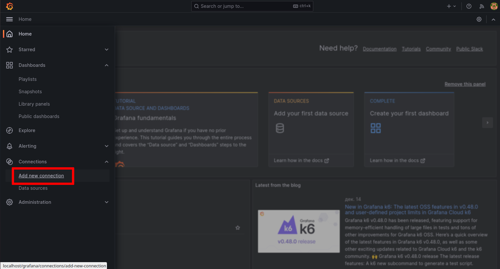
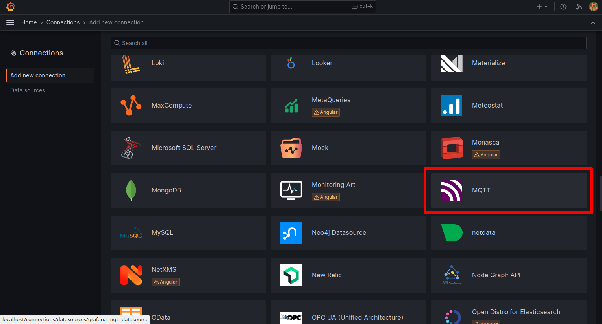
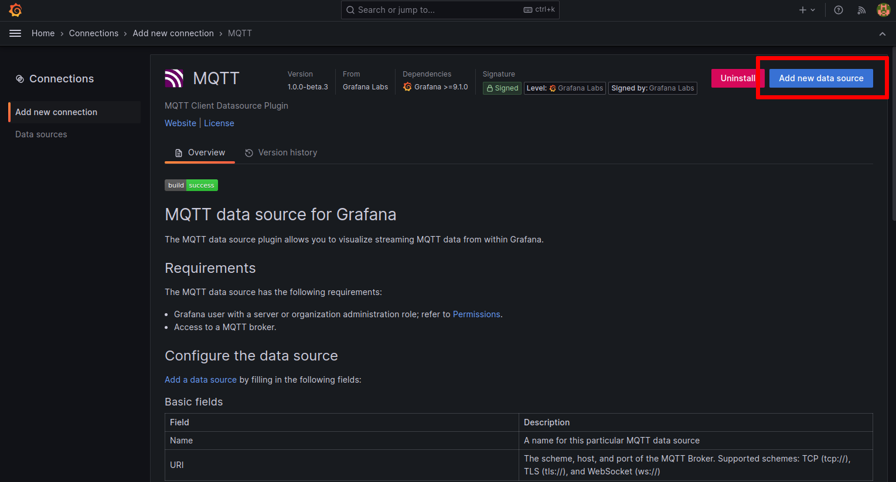
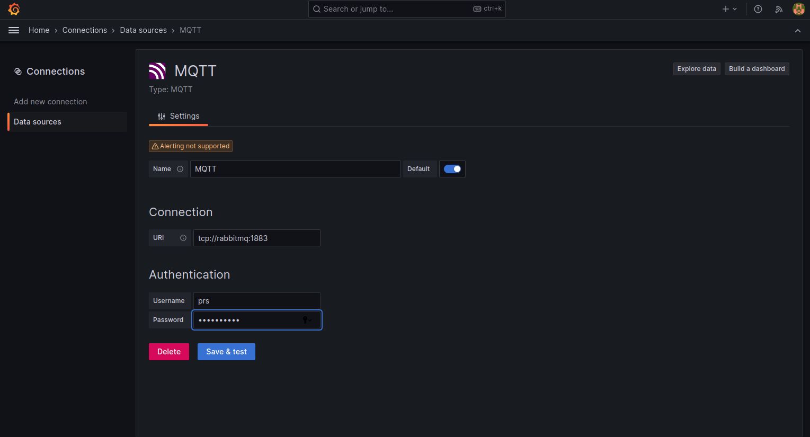
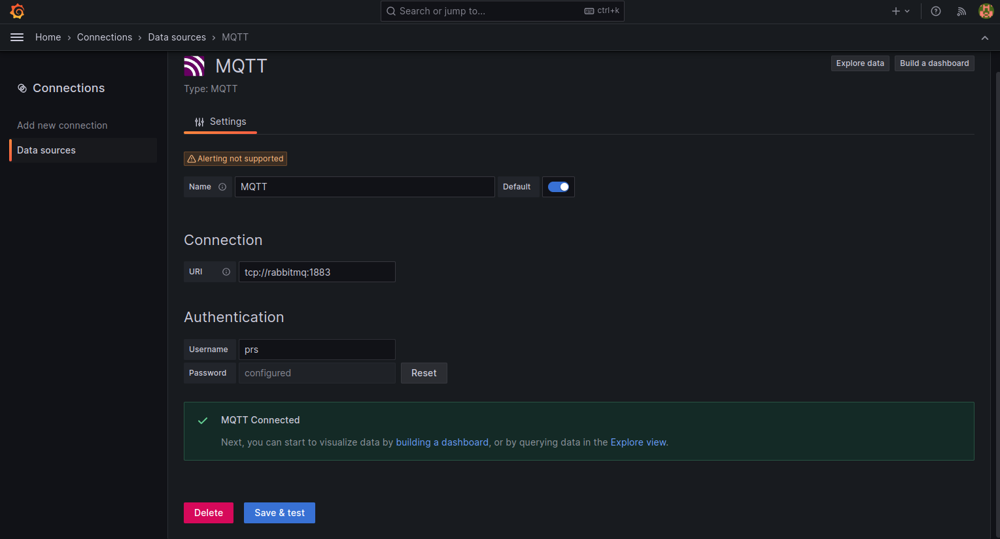

Интеграция с Grafana
====================
Установим платформу и Grafana: :ref:`installation`.

Grafana обменивается данными с платформой с помощью плагина 
`JSON API <https://grafana.com/docs/plugins/marcusolsson-json-datasource/latest/>`_.

Первый запуск Grafana
---------------------
#. Откройте браузер и в строке адреса введите http://localhost/grafana/
#. В форме авторизации введите ``admin`` в качестве пользователя
   и ``admin`` в качестве пароля.
#. Вам будет предложено изменить пароль. Введите новый пароль и в следующий раз
   пользуйтесь им.

Подключение к платформе по протоколу MQTT
-----------------------------------------
В меню Grafana переходим в раздел ``Connections → Add new connection``:

   Меню "Новое соединение"

В списке источников данных выбираем MQTT:

   MQTT

В новом окне нажимаем кнопку ``Add new data source``:

   Добавление нового источника данных

Заполняем параметры источника данных:

   Параметры источника данных

#. **URI**: ``tcp://rabbitmq:1883``
#. **Username**: ``prs``
#. **Password**: ``Peresvet21``.

После ввода данных нажимаем кнопку ``Save and test``, после чего должна
появиться надпись с зелёным фоном о том, что тест источника данных прошёл
успешно:

   Источник данных создан

Отправка данных из Grafana в платформу
--------------------------------------

Для отправки данных из Grafana необходимо установить плагин формы ручного ввода.

Установка плагина
~~~~~~~~~~~~~~~~~

Linux/MacOS
"""""""""""

.. code-block:: sh

   wget "https://github.com/mp-co-ru/grafana-ui-plugin/mp-co-peresvet-app-1-0-0.zip" -O <директория для плагинов в Grafana>/mp-co-peresvet-app-1-0-0.zip
   unzip <директория для плагинов в Grafana>/mp-co-peresvet-app-1-0-0.zip -d <директория для плагинов в Grafana>/mp-co-peresvet-app-1-0-0
   rm <директория для плагинов в Grafana>/mp-co-peresvet-app-1-0-0.zip

.. note::
   Директория для плагинов в Grafana по умолчанию находится по пути `/usr/local/var/lib/grafana/plugins`.

Docker
""""""

.. code-block:: sh

   docker run -d -p 3000:3000 --name=grafana \
   -e "GF_INSTALL_PLUGINS=https://github.com/mp-co-ru/grafana-ui-plugin/mp-co-peresvet-app-1-0-0.zip;mp-co-peresvet-app" \
   grafana/grafana-enterprise

Для его работы дополнительная настройка Grafana не требуется
Подробнее про запуск, конфигурацию и работу плагина

`Плагин для формы ручного ввода в Grafana <./grafana_plugin.rst>`
