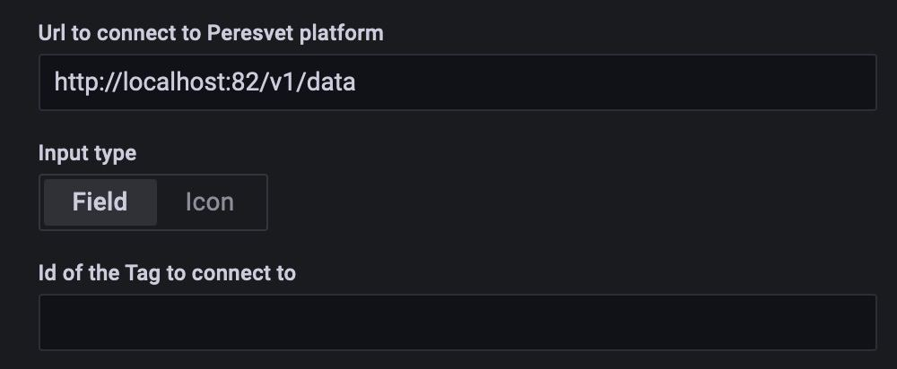
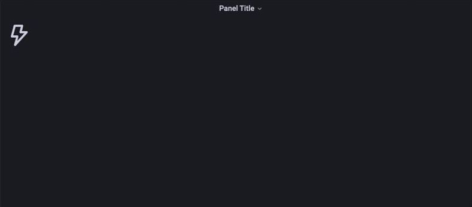
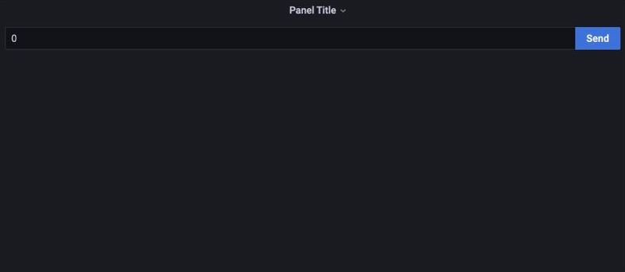
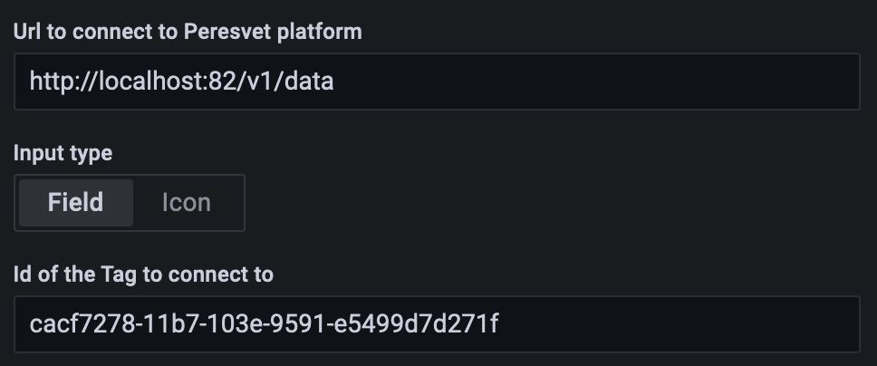
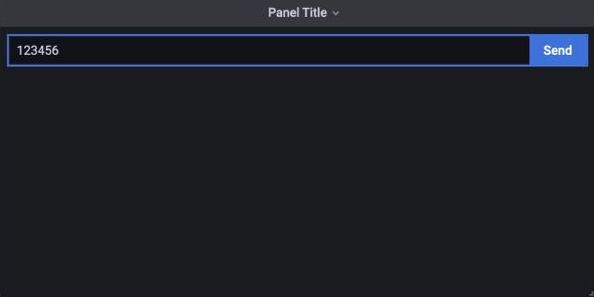

Плагин формы ручного ввода для Grafana
======================================

Плагин позволяет создавать и настраивать панель Grafana с формой ручного ввода.
Для настройки требуется указать url платформы Пересвет, тип поля (текстовое поле / кнопка) и id тега.

**Настройка**

#. Первым указываем url для запроса к сервисам tags_app_api
   платформы Пересвет (например: http://localhost:81/v1/data)
#. Далее можно указать тип формы ручного ввода. Это может быть текстовое поле или кнопка с иконкой.
#. Последнее поле настройки позволяет указать id тега, к которому
   будет привязана данная форма ручного ввода.
   Тег должен быть создан в самой платформе и привязан к определенному хранилищу данных.

   Настройка 1

   Вариант с отображением текстового поля

   Вариант с отображением кнопки с иконкой

   Настройка 3

При правильной настройке плагин сразу отправит запрос к платформе Пересвет,
чтобы получить последнее значение тега, к которому привязана форма ручного ввода.

После настройки данные тегов по каждой форме будут обновляться с периодичностью, указанной в настройках Grafana (5 сек., 10 сек., и др.).

   Время обновления текущего значения тега в панели ручного ввода

Для записи данных в платформу с помощью формы ручного ввода,
необходимо записать значение в тестовое поле формы и нажать кнопку Send.

После этого покруг поля появится синяя граница, которая показывает, что поле было изменено.

   Ввод и отправка значения из формы
